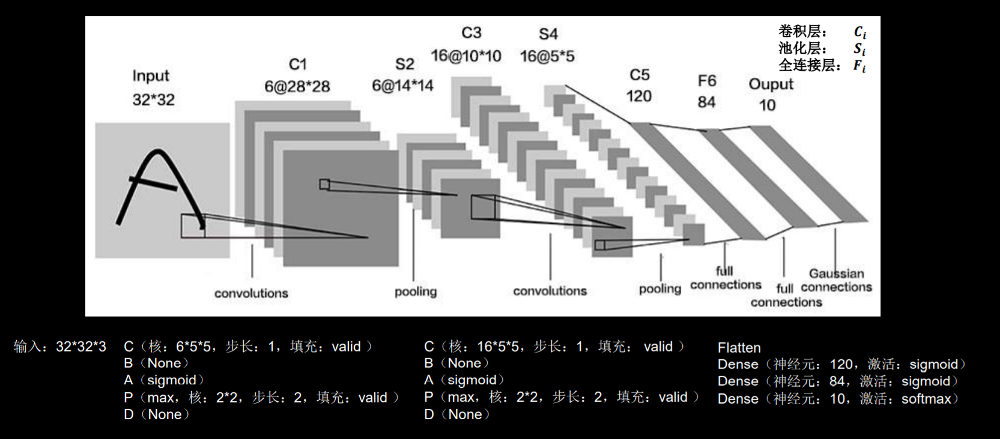
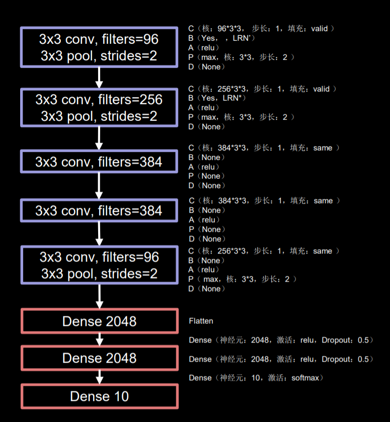
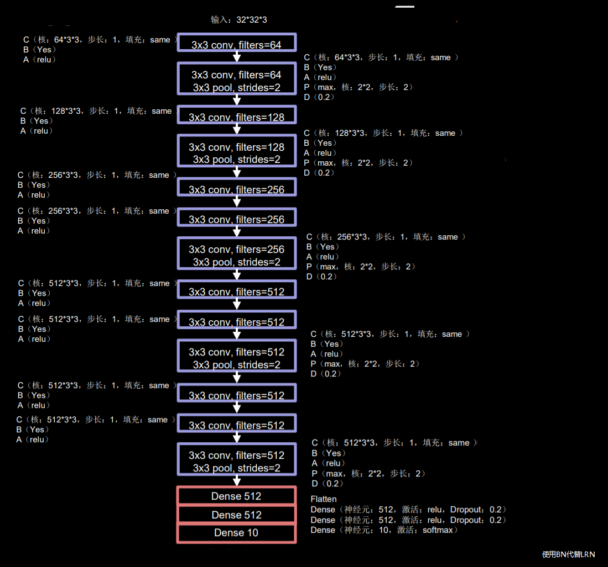
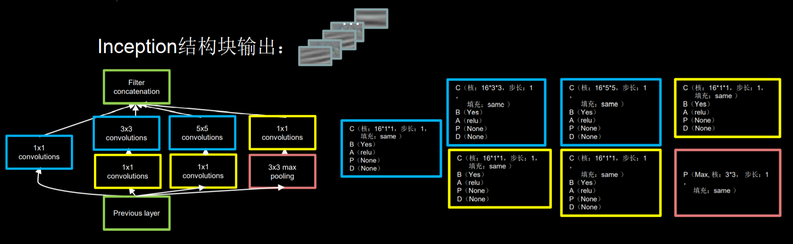
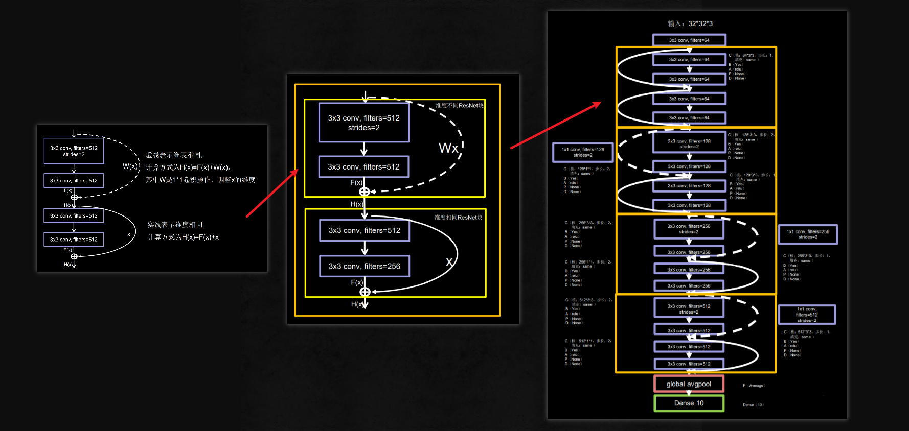
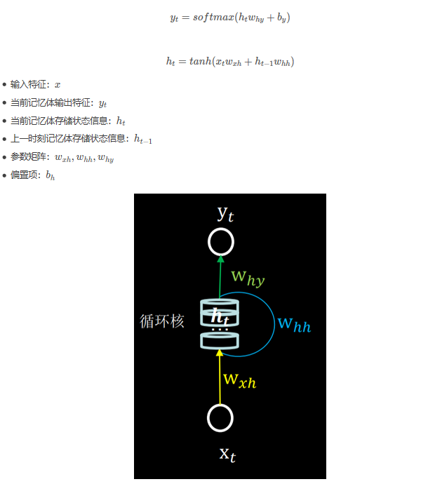
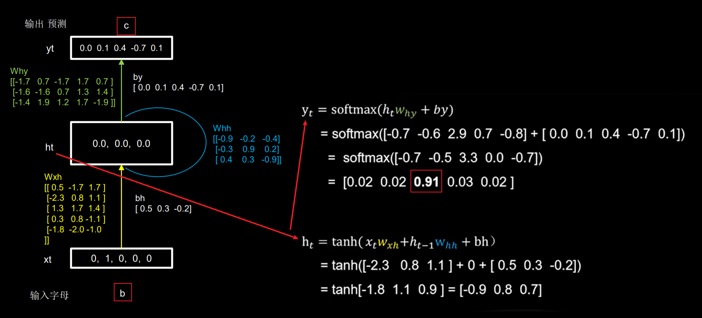
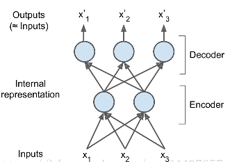

@sofice

[TOC]


# 多层神经网络

用于模式识别


**若干输入，乘上权重，通过S阈值函数，得到输出**

权重初始值可以为随机值，正态分布，均值为0，方差为
$$
\cfrac{1}{\sqrt{inodes}}
$$
`self.wih = numpy.random.normal(0.0, pow(self.inodes, -0.5), (self.hnodes, self.inodes))`

## 多层前馈神经网络

每层神经元与下一层**全连接**，神经元不存在同层连接，也不存在跨层连接

### 正向传播


权重矩阵·输入 = 输出

### 反向传播

反向传播误差进行自学习，自动调整权重

梯度下降法求得误差对各传播路径的权重


其中，△Wjk为权重改变量，α为学习率，Ek为输出误差，Ok为下一层输出，Oj上一层输出


**指数衰减学习率**

$指数衰减学习率=初始学习率*学习率衰减率^{当前轮数/多少轮衰减一次}$

```python
epoch = 40
LR_BASE = 0.2  # 最初学习率
LR_DECAY = 0.99  # 学习率衰减率
LR_STEP = 1  # 喂入多少轮BATCH_SIZE后，更新一次学习率

for epoch in range(epoch):  # for epoch 定义顶层循环，表示对数据集循环epoch次，此例数据集数据仅有1个w,初始化时候constant赋值为5，循环100次迭代。
    lr = LR_BASE * LR_DECAY ** (epoch / LR_STEP)
    with tf.GradientTape() as tape:  # with结构到grads框起了梯度的计算过程。
        loss = tf.square(w + 1)
    grads = tape.gradient(loss, w)  # .gradient函数告知谁对谁求导

    w.assign_sub(lr * grads)  # .assign_sub 对变量做自减 即：w -= lr*grads 即 w = w - lr*grads
    print("After %s epoch,w is %f,loss is %f,lr is %f" % (epoch, w.numpy(), loss, lr))

```

**参数个数**

$\sum_{各层}(前层\times后层+后层)$


## 激活函数

+ sigmoid函数

  
  

+ tanh函数

+ relu函数

+ leaky_relu函数


## 优化器

进行参数优化，减小loss，增大accuracy

待优化参数w，损失函数loss，学习率lr，t表示当前batch迭代的总次数

1. 计算t时刻损失函数关于当前参数的梯度$g_t$
2. 计算t时刻一阶动量$m_t$和二阶动量$V_t$
3. 计算t时刻下降梯度$\eta_t=lr\cdot m_t\sqrt{V_t}$
4. 计算t+1时刻参数$w_{t+1}=w_t-\eta_t$

+ SGD：$m_t=g_t$，$V_t=1$

+ SGDM：$m_t=\beta\cdot m_{t-1}+(1-\beta)\cdot g_t$，$V_t=1$，$\beta=0.9$

+ Adagrad：$m_t=g_t$，$V_t=\sum_{\tau=1}^{t}g_{\tau}^2$

+ RMSProp：$m_t=g_t$，$V_t=\beta\cdot V_{t-1}+(1-\beta)\cdot g_t^2$

+ Adam：$m_t=\beta\cdot m_{t-1}+(1-\beta)\cdot g_t$，$V_t=\beta\cdot V_{t-1}+(1-\beta)\cdot g_t^2$

  $\hat{m_t}=\cfrac{m_t}{1-\beta_1^t}$，$\hat{V_t}=\cfrac{V_t}{1-\beta_2^t}$


## 数据规模

+ 批量学习(BGD)

  每次计算全部样本；可抑制噪声，鲁棒性强，但时间开销大

+ 在线学习(SGD)

  每次用一个样本更新权重；可能无法收敛（可通过降低学习率来解决），单个样本影响过大

+ 小批量梯度下降法(MSGD)

  将数据集划分为若干batch，每次选取一个样本子集进行训练，综合了BGD与SGD的优点

  

## 卷积神经网络(CNN)

**特征提取器CBAPD**：卷积-批标准化-激活-池化-舍弃

+ **感受野**

  卷积输出特征图在原始图像上的映射区域大小

+ **全零填充**

  填充`padding='SAME'`：$输出=\lceil输入/步长\rceil$
  不填充`padding='VALID'`： $输出=\lceil输入-核长+1/步长\rceil$

+ **批标准化(BN)**

  使数据符合0均值，1为标准差的分布，$H_i^k=\cfrac{H_i^k-\mu_{batch}^k}{\sigma_{batch}^k}$，标准化可以是数据重新回归到标准正态分布，常用在卷积操作和激活操作之间

  使进入到激活函数的数据分布在激活函数线性区使得输入数据的微小变化更明显的提现到激活函数的输出，提升了激活函数对输入数据的区分力。但是这种简单的特征数据标准化使特征数据完全满足标准正态分布，集中在激活函数中心的线性区域，使激活函数丧失了非线性特性。

  因此在BN操作中为每个卷积核引入了两个可训练参数，**缩放因子$\gamma$和偏移因子**$\beta$，反向传播时缩放因子$\gamma$和偏移因子$\beta$会与其他带训练参数一同被训练优化。通过缩放因子和偏移因子优化了特征数据分布的宽窄和偏移量。保证了网络的非线性表的力。

+ **池化**

  池化用于减少特征数据量

  **最大值池化**可提取图片纹理，**均值池化**可保留背景特征

  池化层误差传播只在特定单元之间传播（如最大值池化中，本层只有每组含最大值的单元与后一层单元之间传播）

+ **舍弃(Dropout)**

  为了缓解神经网络过拟合，在神经网络训练时，将隐藏层的部分神经元按照一定概率从神经网络中暂时舍弃。神经网络使用时，被舍弃的神经元恢复链接。


### 调参

通常情况下

+ **卷积核数目**越多识别性能越好

+ ReLU和maxout**激活函数**比sigmoid和tanh好

+ **预处理**（ZCA白化，GCN，归一化）对识别性能提升明显
+ 卷积核大小不会对误识别率产生显著影响，通常用5X5卷积核

+ 全连接层个数对识别性能影响不大

+ Dropout，归一化层能略微提升性能
+ 不同学习率，不同Mini-Batch对性能影响不大


### 经典卷积神经网络

+ **LeNet**

  由Yann LeCun于1998年提出，是卷积网络的开篇之作

  共享卷积核，减少网络参数

  

+ **AlexNet**

  AlexNet网络诞生于2012年，当年ImageNet竞赛的冠军，Top5错误率为16.4%

  使用“relu”激活函数，提升了训练速度，使用Dropout缓解过拟合

  

+ **VGGNet**

  VGGNet诞生于2014年，当年ImageNet竞赛的亚军，Top5错误率减小到7.3%
  使用小尺寸卷积核，在减少参数的同时提高了识别的准确率，网络规整适合硬件加速

  

+ **InceptionNet**

  InceptionNet诞生于2014年，当年ImageNet竞赛冠军，Top5错误率为6.67%
  InceptionNet引入了Inception结构块，在同一层网络内使用不同尺寸的卷积核，提升了模型感知力使用了批标准化缓解了梯度消失

  

+ **ResNet**

  ResNet诞生于2015年，当年ImageNet竞赛冠军，Top5错误率为3.57%

  


## 循环神经网络(RNN)






# 相互连接型神经网络

网络不分层，单元之间相互连接，能够根据单元的值记忆网络状态，即**联想记忆**

可用于去除输入数据中的噪声

## Hopfield神经网络

一种相互连接型神经网络

优点：

+ 单元之间的连接权重对称
+ 每个单元没有到自身的链接
+ 单元的状态变化采用随机异步更新方式，每次只有一个单元改变状态

**联想记忆**

使用数据不断训练，单元的状态会一直变化，直到满足终止判断条件，网络达到稳定，此时各单元最终状态就是输出模式 y

记第 i 个单元在 t 时刻输入为：$u_i(t)=\sum_{j=1}^n w_{ij}x_j(t)-b_i(t)$

即当**来自其他单元的输入的加权和大于阈值**时，单元输出为1；小于为0；等于则不变

**能量函数**：$E=-\frac12\sum_{i=1}^n\sum_{j=1}^nw_{ij}x_ix_j+\sum_{i=1}^nb_ix_i$

且有$\Delta E_k=-u_k\Delta x_k$ 

随着时间增加，E逐渐减小，直到 $E=0$ 时，更新终止

输入时，将P个模式 $x^s=(x_1^s,x_2^s,...,x_n^s)(s=1,2,...,P)$ 输入到网络中，求与模式对应能量函数的极小值

假设：1. 所有单元阈值为0；2. $w_{ij}^s=x_i^sx_j^s$；此时能量函数可收敛于极小值，所有模式权重为 $w_{ij}=\frac1P\sum_{s=1}^Px_i^sx_j^s$ 


Hopfield神经网络可以识别带噪声的模式，因此可用于去噪

但模式太多时（可记忆模式数量阈值约为单元数的15%），Hopfield神经网络会发生串扰或陷入局部最优解


## 玻尔兹曼机(Boltzmann Machine,BM)

为解决Hopfield神经网络中发生串扰或陷入局部最优解的问题，玻尔兹曼机在Hopfield神经网络基础上进行改进，**输出不再是确定的，而是按照某种概率分布决定**
$$
p(x_i=1|u_i)=\cfrac{exp(\cfrac{x}{kT})}{1+exp(\cfrac{x}{kT})}\\
p(x_i=0|u_i)=\cfrac{1}{1+exp(\cfrac{x}{kT})}
$$
**温度系数** T>0；T越小，E达到极小值的概率越大，收敛越慢；可使用**模拟退火法**调整温度系数T
$$
玻尔兹曼分布\quad\quad p(x_n|\theta)=\cfrac{1}{Z(\theta)}exp\{-E(x,\theta)\} \\
归一化常数\quad\quad Z(\theta)=\sum_x exp\{-E(x,\theta)\} \\
所有连接权重w和偏置b\quad\quad \theta \\
对数似然函数\quad\quad logL(\theta)=\sum_{n=1}^Nlog p(x_n|\theta)
$$
通过求对w和b的相关梯度，可求出梯度下降值

但似然函数基于所有单元组合计算，**计算量庞大**，可使用近似算法——对比散度算法 解决

玻尔兹曼机含有隐藏单元，会影响可见单元的概率，会增加计算量


## 受限玻尔兹曼机(Restricted Boltzmann Machine,RBM)

分为可见层和隐藏层，层内单元之间无连接，层间相互连接


其可见变量v和隐藏变量h的联合配置(joint configuration)的能量为：

v和h的联合概率：

同样每次计算需要输入模式总和，计算量大，可使用Gibbs采样进行迭代计算求近似解，或CD算法


## 对比散度算法(Contrastive Divergence)

近似算法，能通过较少迭代次数计算出参数调整值


## 深度信念网络

由多层RBM堆叠组成，使用CD算法，逐层调整参数

既可当做生成模型使用，也可当做判别模型使用（在顶层添加特殊层，如softmax层）


# 自编码器(autoencoder,AE)

自编码器是一种能够通过无监督学习，学到输入数据高效表示的神经网络



通过学习编码器和解码器的参数，训练出一个尽可能重构出原始数据的网络，误差函数可选择最小二乘误差或交叉熵代价函数

+ 自动编码器是**数据相关的**（data-specific 或 data-dependent）
+ 自动编码器是**有损的**

训练后的参数可以作为神经网络的参数初始值

## 降噪自编码器

训练样本加上噪声，通过自编码器得到重构结果，将不含噪声的原始训练样本与重构结果计算误差

作用：

+ 保持输入样本不变的条件下，提取能够更好反映样本属性的特征
+ 消除输入样本中包含的噪声


## 稀疏自编码器

中间层单元太少会很难重构输入样本，太多会降低效率，为此加入正则化项，使大部分单元输出变为了0


## 栈式自编码器

相似于深度信念网络，将多层自编码器进行逐层训练，这样就能逐层完成低维到高维的特征提取


