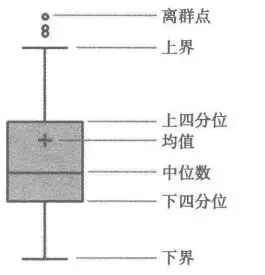

# Machine Learning

**机器学习步骤：**

1. 确定场景类型：数据是什么，需要得到什么，是什么问题

2. 定义损失函数（loss function）：搭建模型的目标是使模型预测的值和实际值接近，因此需要定义损失函数来评估模型效果

3. 提取特征：数据清洗->直接使用还是提取特征->数值型特征还是类别型特征

4. 确定模型形式并估计参数

5. 评估模型效果

**方法=模型+策略+算法**

模型的假设空间内包含可能的函数和参数，要通过策略计算损失函数和风险函数，写出最优的算法。损失函数的期望为风险函数，目的是期望最小，但不能直接计算，由经验风险估计。经验风险最小化（ERM）认为经验风险最小的模型最优，但易过拟合，因此利用结构风险最小化（SRM），加上正则化或惩罚项，即可**使经验风险与模型复杂度同时小**


**模式识别**：用计算的方法根据样本的特征将样本划分到一定的类别中去

借助数学模型理解数据

+ 有监督学习（supervised learning）：对数据的若干特征与若干标签（类型）之间的关联性进行建模的过程
  - 分类 （classifification）
  - 回归（regression）

+ 无监督学习（unsupervised learning）：对不带任何标签的数据特征进行建模，通常被看成是一种“让数据自己介绍自己”的过程
  - 聚类（clustering）
  - 降维（dimensionality reduction）

+ 半监督学习（semi-supervised learning）：在数据标签不完整时使用

  

**特征矩阵**：通常被简记为变量 X。它是维度 为 [n_samples, n_features] 的二维矩阵

**样本**（即每一行）通常是指数据集中的每个对象

**特征**（即每一列）通常是指每个样本都具有的某种量化观测值

**目标数组**：通常简记为 y，一般是一维数组，其长度就是样本总数 n_samples


**Scikit-Learn 评估器 API** 的常用步骤如下所示（后面介绍的示例都是按照这些步骤进行的）。 

1. 通过从 Scikit-Learn 中导入适当的评估器类，选择模型类。 

2. 用合适的数值对模型类进行实例化，配置模型超参数（hyperparameter）。 

3. 整理数据，通过前面介绍的方法获取特征矩阵和目标数组。 

4. 调用模型实例的 fit() 方法对数据进行拟合。 

5. 对新数据应用模型： 

+ 在有监督学习模型中，通常使用 predict() 方法预测新数据的标签； 
+ 在无监督学习模型中，通常使用 transform() 或 predict() 方法转换或推断数据的性质。


**模型持久化**


python-python：内置库pickle

```python
import pickle
model = linear_model.LinearRegression()
model.fit(data[["x"]], data[["y"]])
# 使用pickle存储模型
pickle.dump(model, open(modelPath, "wb"))
# 使用pickle读取已有模型
model = pickle.load(open(modelPath, "rb"))
```

python-java：预测模型标记语言PMML

```python
from sklearn2pmml import PMMLPipeline
from sklearn2pmml import sklearn2pmml
# 利用sklearn2pmml将模型存储为PMML
model = PMMLPipeline([("regressor", linear_model.LinearRegression())])
model.fit(data[["x"]], data["y"])
sklearn2pmml(model, "linear.pmml", with_repr=True)
```


# 模型验证

在选择模型和超参数之后，通过对训练数据进行学习，对比模型对已知数据的预测值与实际值的差异

**模型陷阱**：

+ 使用模型对未知数据做预测：侧重准确度，易受过度拟合干扰——交叉检验
+ 借助模型分析数据的联动效应：侧重可靠性，易受模型幻觉干扰——惩罚项，假设检验

**留出集**

```python
 from sklearn.model_selection import train_test_split
 from sklearn.metrics import accuracy_score
 # 得到训练集测试集
 # 想要每次都一样：保存，指定random_state，使用数据ID
 X1, X2, y1, y2 = train_test_split(X, y, random_state=0, train_size=0.5) 
 # 用模型拟合训练数据
 model.fit(X1, y1) 
 # 在测试集中评估模型准确率
 y2_model = model.predict(X2) 
 accuracy_score(y2, y2_model)
```

**交叉检验**

```python
from sklearn.model_selection import cross_val_score 
# 5折交叉验证
scores = cross_val_score(model, X, y, cv=5)
print(scores.mean())
```

**自助法（Bootstrap）**

每次随机从数据集D中挑选一个样本拷贝到子集$D^{\\'}$中，约有36.8%的样本未出现在$D^{\\'}$中；将$D^{\\'}$作为训练集，$D\setminus D^{\\'}$作为测试集

- 在数据集较小，难以划分训练/测试集时有效

- 能从初始数据集中产生多个不同训练集

- 改变了初始数据集分布，引入估计偏差

**偏差与方差**

对算法的期望泛化错误率进行拆解：（$E[\cdot]$为期望，$\bar{f}(x)=E[f(x)]$，$y_D$为数据集中的标签）

方差：$var(x)=E[(f(x)-\bar{f}(x))^2]$，度量同样大小训练集变动导致的学习性能变化，即**数据扰动**

偏差：$bias^2(x)=(y-\bar{f}(x))^2$，度量算法期望预测与真实结果偏离程度，即**准确率**

噪声：$\epsilon^2=E[(y-y_D)^2]$，度量当前任务上任何算法能达到的期望泛化误差下界，即**问题难度**

**最优模型**

+ 欠拟合：模型灵活性低，偏差高，模型在验证集的表现与在训练集的表现类似——增加输入特征项，增加参数，减少正则化项

+ 过拟合：模型灵活性高，方差高，模型在验证集的表现远远不如在训练集的表现——数据清洗，增大训练集，增多正则化项


**评估模型结果**


+ **查准率**：$Precision=\cfrac{TP}{TP+FP}$ 表示预测为正的样例中有多少是真正的正样例

+ **查全率**：$Recall=\cfrac{TP}{TP+FN}$ 表示样本中的正例有多少被预测正确

+ **精确度**：$Accuracy=\cfrac{TP+TN}{TT+FN+FP+TN}$ 表示分类正确的样本数占样本总数的比例，非平衡数据集会发生准确度悖论从而导致**失真**

+ **平衡查准率与查全率**：$F_\beta=(1+\beta^2)\cfrac{P·R}{\beta^2·P+R}$ 当$\beta$靠近0时，$F_\beta$偏向查准率P，当$\beta$靠近正无穷时，$F_\beta$偏向查全率R，$\beta=1$时为$F1-score$

+ **ROC空间**（Receiver Operating Characteristic）：真阳性率 $TPR=\cfrac{TP}{TP+FN}$，伪阳性率 $FPR=\cfrac{FP}{FP+TN}$，以FPR伪横轴，以TPR为纵轴画图，得到的是ROC空间，其中：

  - 越靠近左上角预测准确率越高
  - 对角线为无意义的随机猜测
  - 对角线下方是把结果搞反了，做相反预测即可
  - 设置不同阈值参数可得到一个点，连起来就是ROC曲线。曲线下方阴影面积为AUC，代表模型预测正确的概率，不依赖于阈值，取决于模型本身
  - 当测试集中的正负样本的分布变换（**类别不平衡**）的时候，ROC曲线能够保持不变

  
  
  ```python
  from sklearn.metrics import roc_curve, auc
  
  logitModel = LogisticRegression()
  logitModel.fit(trainData[features], trainData[label])
  logitProb = logitModel.predict_proba(testData[features])[:, 1]
  # 得到False positive rate和True positive rate
  fpr, tpr, _ = roc_curve(testData[label], logitProb)
  # 得到AUC
  _auc = auc(fpr, tpr)
  # 为在Matplotlib中显示中文，设置特殊字体
  plt.rcParams["font.sans-serif"]=["SimHei"]
  fig = plt.figure(figsize=(6, 6), dpi=80)
  ax = fig.add_subplot(1, 1, 1)
  ax.plot(fpr, tpr, "k", label="%s; %s = %0.2f" % ("ROC曲线", "曲线下面积（AUC）", auc))
  ax.fill_between(fpr, tpr, color="grey", alpha=0.6)
  legend = plt.legend(shadow=True)
  plt.show()
  ```
  


**泛化能力**

该方法学习到的模型对未知数据的预测能力

泛化误差（generalization error）等于模型对未知数据预测的误差期望，使用**泛化误差上界**来判断学习算法的优劣


**超参数调优**

```python
# 网格搜索
from sklearn.model_selection import GridSearchCV
```


# 数学

+ **梯度下降法**

  每次将估计值向梯度的负方向进行修改，可加上步长（学习率），当每次只是用一个误分类的样本进行更新时，称为**随机梯度下降法**，更新过后以前的误分类点可能会正确分类

+ **牛顿法**

  使用海森矩阵和泰勒展开公式，近似的用点的函数值表示实际函数值，由此推导出递推公式，当使用另一个矩阵近似海森矩阵以简化计算量时，称为**拟牛顿法**

+ **拉格朗日乘子法**

  考虑函数f(x)在约束g(x)下求极值的问题，有如下结论：

  - 对于约束曲面上的任一点$x$，该点的梯度$\nabla g(x)$正交与约束曲面
  - 在最优点$x^*$，目标函数在该点的梯度$\nabla f(x^*)$正交与约束曲面

  因此有$\nabla f(x^*)+\lambda\nabla g(x^*)=0,\lambda\not=0$，此式即为拉格朗日函数对x求偏导得到

  最优化问题，广义拉格朗日函数，KKT条件如下：
  $$
  min_xf(x)\\
  s.t.\quad h_i(x)=0，g_j(x)\leqslant0\\
  L(x,\lambda,\mu)=f(x)+\sum_{i=1}^m\lambda_ih_i(x)+\sum_{j=1}^n\mu_jg_j(x)\\
  KKT:\begin{cases} 
  \nabla_x L(x,\lambda,\mu)=0\\
  h_i(x)=0\\
  g_j(x))\leqslant0\\
  \mu_j \geqslant 0\\
  \mu_jg_j(x)=0\\
  \end{cases}
  $$
  
+ **拉格朗日对偶性**
$$
定义\quad \theta_P(x)=max_{\lambda,\mu;\,\mu_i\geqslant0}\,L(x,\lambda,\mu)\\
  则\quad \theta_P(x)=\begin{cases} 
  f(x),\quad x满足原始问题约束\\
  +\infty,\quad 其他
  \end{cases}\\
  原始最优化问题等价于极小极大问题\quad p^*=min_x\theta_P(x)=min_x\,\,max_{\lambda,\mu;\,\mu_i\geqslant0}\,L(x,\lambda,\mu)\\
  定义下确界\quad \theta_D(\lambda,\mu)=min_x\,L(x,\lambda,\mu)=inf_x\,L(x,\lambda,\mu)\\
  则有对偶问题（极大极小问题）\quad d^*=max_{\lambda,\mu;\,\mu_i\geqslant0}\theta_D(\lambda,\mu)=max_{\lambda,\mu;\,\mu_i\geqslant0}\,\,min_xL(x,\lambda,\mu)\\可证明\quad d^* \leqslant p^*
$$

​       将原最优化问题，转化为求广义拉格朗日函数的极小极大问题，再转化为极大极小问题的对偶问题，两个问题在一定条件下等价，需要满足KKT条件

+ **贝叶斯估计**

  与**极大似然估计（MLE）**不同，贝叶斯估计认为参数是不确定的值，具有一定的概率分布，需要求出给定样本集情况下，参数的最大概率取值，同样也是取对数求偏导解似然方程组，需要知道参数的先验分布。当样本数足够大时，两种的参数估计值相同，当样本小且参数先验分布较准确时，贝叶斯估计较准确
  
  常使用**拉普拉斯平滑**来解决训练集某特征不出现的情况，分子加$\lambda$，分母加$N\lambda$
  
+ **凸优化问题**

  具有形式：
  $$
  min_{w}f(w)\\
  s.t. g_i(w)\leqslant0 i=1,2,...,k\\
  h_i(w)=0, i=1,2,...,k
  $$
  其中，f(w)和g(x)是连续可微凸函数，h(w)是仿射函数
  
  当f(w)是二次函数且g(w)是仿射函数时，上述问题成为**凸二次规划问题**
  
+ **核方法**

  优化问题中，当正则化项$\Omega(||h||_H)$单调递增，损失函数非负时，优化问题的最优解总可以表示成核函数的线性组合：$h^*(x)=\sum_{i=1}^m\alpha_iK(x,x_i)$
  
+ **信息论**

   默认log底数为2
  
  - **信息量**：$I(x_0)=-logP(x_0)$，表示获取信息的多少，事件发生概率越大，获取到的信息量越少，P为频率（0log0=0）
  - **熵(Entropy)**：$H(X)=-\sum_iP(x_i)logP(x_i)$，是信息量的期望，熵越大随机变量不确定性越大，当随机变量各取值概率一样时熵达到最大，单位比特
  - **条件熵**：$H(Y|X)=\sum_{i=1}^np_iH(Y|X=x_i)，X有n种取值$ ，表示在已知随机变量X的条件下随机变量Y的不确定性
  - **信息增益(InfoGain)**：$g(D,A)=H(D)-H(D|A)$，表示得知特征A的信息而使数据集D的分类的不确定性减少的程度，信息增益大的特征具有更强的分类能力
  - **信息增益比**：$g_R(D,A)=\cfrac{g(D,A)}{H_A(D)}$
  - **相对熵（KL散度）**：$D_{KL}(P||Q)=\sum_iP(x_i)ln\cfrac{P(x_i)}{Q(x_i)}=-H(P(x))+H(P,Q)$，表示如果用P来描述目标问题，而不是用Q来描述目标问题，得到的信息增量。在机器学习中，P往往用来表示样本的真实分布，Q用来表示模型所预测的分布，相对熵的值越小，表示P分布和Q分布越接近。可使用$D_{KL}(y||\hat{y})$评估label和predicts之间的差距
  - **交叉熵**：$H(P,Q)=-\sum_iP(x_i)lnQ(x_i)$ ，KL散度中前一部分P的熵不变，可使用交叉熵代替均方误差等作为loss函数，表示两个概率分布之间的距离
  - **基尼指数**：$Gini(p)=\sum_{k=1}^Kp_k(1-p_k)=1-\sum_{k=1}^Kp_k^2，K为类别数;二分类Gini(p)=2p_1p_2$；数据集被条件（$特征Ai==a$）划分为两个子集，则  $Gini(D,Ai)=p_{D_1}Gini(D_1)+p_{D_2}Gini(D_2)$  （**2分类只有1种分类方法，n分类有n种分类方法**）
  
+ **监督式降维**

  在二维平面上，要求把点投影到一条直线上，直线的方向向量为$w$，则点X投影点到原点的距离为$w^TX$，假设只有两个类别0、1，降维后，希望同类别投影点近（协方差小），不同类别投影点远（中心距离大），即：
  $$
  记第i类:集合X_i\quad均值向量\mu_i\quad协方差矩阵\Sigma_i\quad中心投影距离w^T\mu_i\quad投影点协方差w^T\Sigma_iw\\
  最大化目标：J=\cfrac{||w^T\mu_0-w^T\mu_1||_2^2}{w^T\Sigma_0w+w^T\Sigma_1w}=
  \cfrac{w^T(\mu_0-\mu_1)(\mu_0-\mu_1)^Tw}{w^T(\Sigma_0+\Sigma_1)w}\\
  定义\quad类间散度矩阵：S_b=(\mu_0-\mu_1)(\mu_0-\mu_1)\quad 类内散度矩阵：S_w=\Sigma_0+\Sigma_1\\
  则：J=\cfrac{w^TS_bw}{w^TS_ww}\\
  解得：w^*=s_W^{-1}(\mu_0-\mu_1)
  $$
  
+ **EM算法**

  用于含有隐变量的概率模型参数的极大似然估计

  不同的初值可能得到不同的参数估计值；不能保证找到全局最优值

  可用于生成模型的无监督学习
  $$
  记\quad 观测随机变量（不完全数据）Y\quad 隐随机变量Z\quad完全数据Y+Z\quad模型参数\theta（初值\theta^{(0)}）\\
  迭代求\quad L(\theta)=logP(Y|\theta) \quad的最大似然估计\quad\\
  E步：第i+1次迭代计算Q函数\quad Q(\theta,\theta^{(i)})=E_z[logP(Y,Z|\theta)|Y,\theta^{(i)}]=\sum_Z logP(Y,Z|\theta)P(Z|Y,\theta^{(i)})\\
  M步：\theta^{(i+1)}=arg\,max_\theta Q(\theta,\theta^{(i)})
  $$
  推广有GEM算法

+ **高斯混合模型**

  用任意概率分布代替高斯分布密度可得到一般混合模型

  高斯混合模型可以用EM算法估 计参数 $\theta=(\alpha_k,\theta_k)$
  $$
  具有分布概率:P(y|\theta)=\sum_{k=1}^K\alpha_k\phi(y|\theta_k)\\
  \alpha_k\geqslant0,\sum_{k=1}^K\alpha_k=1;\quad \phi(y|\theta_k)是高斯分布密度，\theta_k=（\mu_k,\sigma_k^2）
  $$
  
+ **聚类距离**

  - 闵可夫斯基距离

    $d_{ij}=(\sum_{k=1}^m|x_{ki}-x_{kj}|^p)^{\frac1p},p\geqslant 1$，$p=$1为曼哈顿距离，$p=2$为欧氏距离，$p=\infin$为切比雪夫距离（取各个坐标数值差的绝对值的最大值）

  - 马哈拉诺比斯距离

    $d_{ij}=[(x_i-x_j)^TS^{-1}(x_i-x_j)]^{\frac12}$，S 为 X 的协方差矩阵

  - 相关系数

  - 夹角余弦

- 前向分步算法

  为得到加法模型：$f(x)=\sum_{m=1}^M\beta_mb(x;\gamma_m)$，需要求解损失函数极小化问题：$min_{\beta_m,\gamma_m}\sum_{i=1}^NL(y_i,\sum_{m=1}^M\beta_mb(x;\gamma_m))$，前向分步算法将同时求解$m=1 toM$所有参数问题简化为逐次求解各个$\beta_m,\gamma_m$

  1. 初始化$f_0(x)=0$
  2. 对于$m=1,2,...,M$，$(\beta_m,\gamma_m)=argmin_{\beta,\gamma}\sum_{i=1}^NL(y_i,f_{m-1}(x_i)+\beta b(x;\gamma)),\quad f_m(x)=f_{m-1}(x)+\beta_m b(x;\gamma_m))$
  3. 得到加法模型：$f(x)=f_M(x)=\sum_{m=1}^M\beta_mb(x;\gamma_m)$


  

  

  

  

  


# 监督式学习

## 感知机(Perceptron)

**原始形式**

给定训练集$X,y\in\{-1,1\}$，感知机$sign(w·x+b)$学习的损失函数为$L(w,b)=-\sum_{x_i\in m}y_i(w·x_i+b)$

感知机算法是误分类驱动的，采用随机梯度下降法，每次选取一个误分类点对w,b进行更新：$w:=w+\eta y_ix_i，b:=b+\eta y_i$，$\eta\in(0,1]$称为学习率（步长），误分条件为：$y_i(w·x_i+b)\leqslant0$

**对偶形式**

令$\alpha_i=n_i\eta$，则误分条件为：$y_i(\sum_{j=1}^Na_jy_jx_j·x_i+b)\leqslant0$，更新：$\alpha_i:=\alpha_i+\eta，b:=b+\eta y_i$，结果求得$w=\sum_{i=1}^N\alpha_iy_ix_i$。在求误分条件时所用内积可以先求出来存在矩阵中（**Gram矩阵**）：$G=[x_i·x_j]_{N\times N}$

可以证明感知机的原始和对偶形式都是收敛的

```python
from sklearn.linear_model import Perceptron
# 参数：正则化项penalty=None/l1/l2 正则化系数alpha 学习率eta0 最大迭代次数max_iter=5 终止阈值tol=None
perceptron = Perceptron()
perceptron.fit(X,y)
# 模型参数w，b和迭代次数
w = perceptron.coef_ 
b = perceptron.intercept_
it = perceptron.n_iter_
# 预测准确率
perceptron.score(X,y)
```

**当特征维度大时用对偶形式，当样本多时用原始形式**


## k邻近(k-nearest neighbor)

给定距离度量，选取最“近”的k个点，再根据给定分类决策规则，确定类别

非参数算法，最简单有效；但必须**保存全部数据集，使用大量存储空间**；对每个数据计算距离值，**耗时很大**；无法给出任何数据的基础结构信息，无法得到平均样本和典型样本的特征

**距离度量**

> 数学-聚类距离

**k值选择**

k值越小，近似误差越小，估计误差越大，模型更复杂，容易过拟合，一般使用交叉验证选取一个比较小的值

**分类决策规则**

多数表决规则等价于经验风险最小化

**KD-Tree**

对k维空间中的实例点进行存储以便对其进行快速检索的树形结构，是一种二叉树。依次选择坐标轴对空间切分，选择训练实例点在坐标轴上的中位点为切分点时，直到子区域没有实例，得到的kd树是平衡的，但搜索效率未必是最优的

搜索时，先找到目标点对应的叶子节点，对应划分点为最邻近点，为再向上一层一层回溯，找兄弟节点中是否有实例包含在超球体内，如有则更新最邻近点，时间复杂度为$O(logn)$


## 线性回归(Linear Regression)

简洁，高效，容易理解

特征（features）为自变量，标签（labels）为因变量


**数学推导**

给定一组数据，找出一种关系来预测标签：
$$
X=\begin{bmatrix}
x_{11}&x_{12}&...&x_{1d}&1\\
x_{21}&x_{22}&...&x_{2d}&1\\ 
...&...&...&...&1\\
x_{m1}&x_{m2}&...&x_{md}&1\\
\end{bmatrix}\\
y=(y_1,y_2,...,y_m)^T\\
广义参数\quad\hat{w}=(w_1,...,w_n;b)^T\\
y=X\hat{w}^T
$$
这里采用平方误差求最优$\hat{w}$： $f(\hat{w})=\sum_{i=1}^m(y_i-x_i^T\hat{w})^2$

对于上述式子$f(\hat{w})$可以通过梯度下降等方法得到最优解。但是使用矩阵表示将会使求解和程序更为简单：$f(\hat{w})=(y-X\hat{w})^T(y-X\hat{w})$

将$f(\hat{w})$对$\hat{w}$求导可得：$\cfrac{\partial f(\hat{w})}{\partial \hat{w}}=2X^T(X\hat{w}-y)$

当$X^TX$为满秩矩阵或正定矩阵时，使上式等于0，便可得到：$\hat{w}=(X^TX)^{-1}X^Ty$

实际中，$X^TX$往往不是满秩矩阵，此时可引入正则化项

模型可推广至**广义线性模型**：$y=g^{-1}(w^Tx+b)$


**损失函数**

+ Least Absolute Deviations(LAS)： $L=\sum_i|y_i-\hat{y}_i|$ 
  
  对异常值更加稳定
  
+ Odinary Least Squares(OLS)： $L=\sum_i(y_i-\hat{y}_i)^2$
  数学基础更加扎实，与统计学最大似然估计法的结果一致

**模型评估**

+ 均方差(MSE）:    $MSE=\cfrac{1}{n}\sum_{i=1}^n(y_i-\hat{y}_i)^2=\cfrac{1}{n}L$，平均误差=$\sqrt{MSE}$
+ 决定系数（coefficient of determination）：$SS_{tot}=\sum_i(y_i-\bar{y})^2$； $SS_{res}=\sum_i(y_i-\hat{y}_i)^2$； $R^2=1-\cfrac{SS_{res}}{SS_{tot}}$，决定系数表示有多少的因变量变化能由模型解释

```python
from sklearn.linear_model import LinearRegression
import statsmodels.api as sm
from statsmodels.sandbox.regression.predstd import wls_prediction_std

def linearModel(data):
    """
    线性回归模型机器学习
    
    参数
    ----
    data : DataFrame，建模数据
    """
    features = ["x"]
    labels = ["y"]
    # 划分训练集和测试集
    trainData = data[:15]
    testData = data[15:]
    
    # 产生并训练模型
    # 创建一个线性回归模型
    model = linear_model.LinearRegression()
    # 训练模型，估计模型参数
    model.fit(trainData[features], trainData[labels])
    #  斜率：model.coef_，截距：model.intercept_
    
    # 评价模型效果
    # 均方差(The mean squared error)，均方差越小越好
    error = np.mean(
        (model.predict(testData[features]) - testData[labels]) ** 2)
    # 决定系数(Coefficient of determination)，决定系数越接近1越好
    score = model.score(testData[features], testData[labels])
    
def linearModel(data):
    """
    线性回归统计性质分析

    参数
    ----
    data : DataFrame，建模数据
    """
    features = ["x"]
    labels = ["y"]
    Y = data[labels]
    # 加入常量变量
    X = sm.add_constant(data[features])
    # 构建模型
    model = sm.OLS(Y, X)
    re = model.fit()
    
    # 分析模型效果
    # 整体统计分析结果
    print(re.summary())
    # 用f_test检测x对应的系数a是否显著，P-value小于0.05则拒绝
    print("检验假设x的系数等于0：")
    print(re.f_test("x=0"))
    
    # const并不显著，去掉这个常量变量
    model = sm.OLS(Y, data[features])
    resNew = model.fit()
    # 输出新模型的分析结果
    print(resNew.summary())
```


**惩罚项**

+ Lasso回归：使用L1范数  $L=\sum_i(y_i-ax_i-bx_i-c)^2+\alpha(|a|+|b|+|c|)$，**参数更容易为0变稀疏**

+ Ridge回归（岭回归）：使用L2范数  $L=\sum_i(y_i-ax_i-bx_i-c)^2+\alpha(a^2+b^2+c^2)$，**参数更容易减小降低复杂度**

*超参数*$\alpha>0$时，惩罚项会随a,b,c绝对值的增大而增大，即参数越远离0，惩罚就越大，因此在寻找L的最小值时，这一项会迫使参数估计值向0靠近

超参数存在时，采用网格搜寻（设置几组针对超参数的控制变量组，来找最小均方差的超参数）和验证集（将数据分为训练集，验证集，测试集）

```python
reg = linear_model.Ridge(alpha=.5)
reg.fit([[0, 0], [0, 0], [1, 1]], [0, .1, 1])
reg = linear_model.Lasso(alpha=0.1)
reg.fit([[0, 0], [1, 1]], [0, 1])
# statsmodels
model = sm.OLS(Y, X)
res = model.fit_regularized(alpha=alpha)
```

下图为$\alpha$改变时三个参数的变化规律


+ 前向逐步回归：贪心，开始所有权重设为1，每一步对某个权重增加或减少一个值，迭代若干次即可收敛得到超参数

```python
def stageWise(xArr,yArr,eps=0.01,numIt=100):
    """
    前向逐步回归

    参数
    ----
    xArr : []，输入数据
    yArr : []，预测数据
    eps  : 步长
    numIt: 迭代次数
    """
    xMat = mat(xArr)
    yMat=mat(yArr).T
    yMean = mean(yMat,0)
    yMat = yMat - yMean     #can also regularize ys but will get smaller coef
    xMat = regularize(xMat)
    m,n=shape(xMat)
    #returnMat = zeros((numIt,n)) #testing code remove
    #ws = zeros((n,1)) #初始所有权重为0
    ws = ones((n,1)) #初始所有权重为1
    #wsMax = ws.copy()
    Mat = zeros((numIt, n))
    for i in range(numIt):
        if i%1000 ==0 : #每迭代1000次，打印归回系数
            print("第%d次迭代后回归系数为："%i,end ="")
            print(ws.T)
        lowestError = inf #初始误差设为正无穷大
        for j in range(n):
            for sign in [-1,1]: # 贪心算法，左右试探
                wsTest = ws.copy() # 初始化
                wsTest[j] += eps*sign #eps 为步长
                yTest = xMat*wsTest #预测值
                rssE = rssError(yMat.A,yTest.A)
                if rssE < lowestError:
                    lowestError = rssE
                    wsMax = wsTest
        ws = wsMax.copy()
        Mat[i,:]=ws.T
    return Mat
```

相比假设检验更加自动化，工程化，理论基础较差，可解释性差


**假设检验**

理论基础更牢，更容易理解数据之间关系，需要较多人工干预，随意性较大


**局部加权线性回归（Locally Weighted Linear Regression, LWLR）**

一种非参数算法，没有训练步骤，而是直接使用训练集进行预测。在做预测时，更多地参考距离预测样本近的已知样本，而更少地参考距离预测样本远的已知样本

原均方差和修改后均方差如下所示：

$\mathcal{L} = \dfrac{1}{2} \left[ \left(y^{(1)} -  \boldsymbol{\theta}^T \mathbf{x}^{(1)} \right)^2 + \left(y^{(2)} -  \boldsymbol{\theta}^T \mathbf{x}^{(2)} \right)^2 + \cdots +  \left(y^{(m)} - \boldsymbol{\theta}^T \mathbf{x}^{(m)} \right)^2 \right]$

$\begin{align*} \mathcal{L} &= \dfrac{1}{2} \left[ w^{(1)}  \left(y^{(1)} - \boldsymbol{\theta}^T \mathbf{x}^{(1)} \right)^2 +  w^{(2)} \left(y^{(2)} - \boldsymbol{\theta}^T \mathbf{x}^{(2)} \right)^2 + \cdots + w^{(m)} \left(y^{(m)} - \boldsymbol{\theta}^T  \mathbf{x}^{(m)} \right)^2 \right] \\ &= \frac{1}{2} \sum_{i=1}^m  w^{(i)} \left(y^{(i)} - \boldsymbol{\theta}^T \mathbf{x}^{(i)}\right)^2 \end{align*}$

修改后的加上了权重w：

$w^{(i)} = \exp \left( - \dfrac{\left(\mathbf{x}^{(i)} - \mathbf{x}\right)^2}{2k^2} \right)$

缺点是每个点做预测时都要使用整个数据集，计算量大，可改进


## 对数几率回归(Logistic Regression)

无需事先假设数据分布，可以得到近似概率预测，有利于需要利用概率辅助决策的任务

考虑用广义线性模型：$y=g^{-1}(w^Tx+b)$解决分类问题，此时联系函数为单位阶跃函数，用对数几率函数替代：$y=\cfrac{1}{1+e^{-(w^Tx+b)}}$，也即：$ln\cfrac{y}{1-y}=w^Tx+b$，将y视为后验概率估计，则可重写为$ln\cfrac{P(y=1|x)}{P(y=0|x)}=w^Tx+b$，其中$\cfrac{P}{1-P}$为**事件发生比**（odds）

模型认为观察得到的结果由正效用$P(y=1|x)$和负效用$P(y=0|x)$确定（称为隐含变量）

显然有**对数几率回归模型**：$P(y=1|x)=\cfrac{ e^{(w^Tx+b)}}{1+e^{(w^Tx+b)}}=\pi(x)，P(y=0|x)=\cfrac{1}{1+e^{(w^Tx+b)}}=1-\pi(x)$

似然函数为：$\prod_{i=1}^N[\pi(x_i)]^{y_i}[1-\pi(x_i)]^{1-y_i}$，定义广义参数：$\beta=(w_1,...,w_n;b)^T$

**损失函数**：$L(w)=\sum_{i=1}^N[y_iln\pi(x_i)+(1-y_i)ln(1-\pi(x_i)]=\sum_{i=1}^N[y_i(\beta^Tx_i)-ln(1+e^{(\beta^Tx_i+b)}]$ 

可使用改进的迭代尺度法或拟牛顿法解决最大熵最优化问题


```python
from sklearn.model_selection import train_test_split
import statsmodels.api as sm
from statsmodels.graphics.mosaicplot import mosaic

data = pd.read_csv(path)
cols = ["age", "education_num", "capital_gain", "capital_loss", "hours_per_week", "label"]
data = data[cols]
data[["age", "hours_per_week", "education_num", "label_code"]].hist(
     rwidth=0.9, grid=False, figsize=(8, 8), alpha=0.6, color="grey")
plt.show()

# 显示基本统计信息
print(data.describe(include="all"))
# 计算education_num, label交叉报表
cross1 = pd.crosstab(pd.qcut(data["education_num"],  [0, .25, .5, .75, 1]), data["label"])
print(cross1)
# 将交叉报表图形化
props = lambda key: {"color": "0.45"} if ' >50K' in key else {"color": "#C6E2FF"}
mosaic(cross1[[" >50K", " <=50K"]].stack(), properties=props)
# 计算hours_per_week, label交叉报表
cross2 = pd.crosstab(pd.cut(data["hours_per_week"], 5), data["label"])
# 将交叉报表归一化，利于分析数据
cross2_norm = cross2.div(cross2.sum(1).astype(float), axis=0)
print(cross2_norm)
# 图形化归一化后的交叉报表
cross2_norm.plot(kind="bar", color=["#C6E2FF", "0.45"], rot=0)
plt.show()

# 将数据分为训练集和测试集
trainSet, testSet = train_test_split(data, test_size=0.2, random_state=2310)
# 搭建逻辑回归模型，并训练模型
formula = "label_code ~ age + education_num + capital_gain + capital_loss + hours_per_week"
model = sm.Logit.from_formula(formula, data=data)
re = model.fit()

# 整体统计分析结果
print(re.summary())
# 计算各个变量对事件发生比的影响
# conf里面的三列，分别对应着估计值的下界、上界和估计值本身
conf = re.conf_int()
conf['OR'] = re.params
conf.columns = ['2.5%', '97.5%', 'OR']
print(np.exp(conf))
# 计算各个变量的边际效应
print(re.get_margeff(at="overall").summary())

# 计算事件发生的概率
testSet["prob"] = re.predict(testSet)
# 根据预测的概率，得出最终的预测
testSet["pred"] = testSet.apply(lambda x: 1 if x["prob"] > alpha else 0, axis=1)
```

**多元分类**

+ 多元逻辑回归：使用多个隐含变量模型
+ OvO：一对一，OvR：一对其余，MvM：多对多（纠错输出码，ECOC）

```python
from sklearn.linear_model import LogisticRegression

model = LogisticRegression(multi_class='multinomial', solver='sag',max_iter=1000)
# model = LogisticRegression(multi_class='ovr', solver='sag',max_iter=1000)
model.fit(data[features], data[labels])
```

**非均衡数据集**

数据标签偏向若干个，可通过修改损失函数里不同类别的权重来解决，使用再缩放：$\cfrac{y^*}{1-y^*}=\cfrac{y}{1-y}\times\cfrac{m^-}{m^+}$

```python
# 通过调整各个类别的比重，解决非均衡数据集的问题
positiveWeight = len(Y[Y>0]) / float(len(Y))
classWeight = {1: 1. / positiveWeight, 0: 1. / (1 - positiveWeight)}
# 为了消除惩罚项的干扰，将惩罚系数设为很大
model = LogisticRegression(class_weight=classWeight, C=1e4)
model.fit(X, Y.ravel())
```


## 支持向量机(SVM)

如图，空间中的直线可以用一个线性方程来表示：$w·x+b=0$ ，w为法向量，法向量指向一侧为正类

**函数间隔**：$样本点\hat{\gamma_i}=y_i(w·x+b)，超平面\hat{\gamma}=min\hat{\gamma_i}$，表示分类的正确性

**几何间隔**：$\gamma = \hat{\gamma}/||w||$，表示点与超平面距离


**硬间隔最大化**

原始问题为：
$$
max_{w,b}\hat{\gamma}/||w||\\
s.t. y_i(w·x_i+b)\geqslant\hat{\gamma}
$$

函数间隔取值不影响最优化问题的解，取$\hat{\gamma}=1$，并对损失函数作等价替换：
$$
min_{w,b}\frac12||w||^2\\
s.t.\quad y_i(w·x_i+b)-1\geqslant0
$$
此时演变成一个**凸二次规划问题**，分类决策函数为$f(x)=sign(w^*·x+b^*)$


**软间隔最大化**

对于**线性不可分问题**，需要加入**松弛参数$\xi$**和**惩罚参数$C$**，其中$\xi_i$与点 i 离相应虚线的距离成正比，表示数据 i 这一点违反自身分类原则的程度，所有点的$\xi_i$和越小越好，合并损失函数：
$$
min_{w,b,\xi}\,\, \frac12||w||^2+C\sum_{i=1}^N\xi_i\\
s.t. \quad y_i(w·x_i+b)\geqslant1-\xi_i,\quad \xi_i\geqslant0
$$
将上述原始问题转化为对偶问题：
$$
max_{\alpha}\,\, -\frac12 \sum_{i=1}^N\sum_{j=1}^N\alpha_i\alpha_jy_iy_j(x_i·x_j)+\sum_{i=1}^N\alpha_i\\
s.t.\quad \sum_{i=1}^N\alpha_iy_i=0, \quad 0\leqslant\alpha_i\leqslant C
$$
事实上是寻找与被测数据相似的训练数据，并将相应的因变量加权平均得到最后的预测值。只有在虚线上或虚线内的点权重才不为0，其他点权重都为0：


引入合页损失函数（取正值）后，可将上述原始最优化问题等价为：
$$
min_{w,b,\xi}\quad \lambda||w||^2+\sum_{i=1}^N[1-y_i(w·x_i+b)]_+
$$
损失函数的前一部分为**L2惩罚项**，后一部分为**预测损失LL（hinge loss）**，代替0/1损失函数

其中超参数C是模型预测损失的权重，C越大表示模型越严格，margin越小，考虑的点越少，称为**hard margin**，C越小考虑的点越多，称为**soft margin**


**核函数**

$K(x_i,x_j)=\phi(x_i)·\phi(x_j)$ ，其中$\phi(x)$为空间变换

利用核函数，可以极大减少模型运算量，隐式地在特征空间进行学习，不需要显式定义特征空间和映射函数，并且完成未知的空间变换，将对偶问题中的向量点乘变为核函数即可：
$$
max_{\alpha}\,\, -\frac12 \sum_{i=1}^N\sum_{j=1}^N\alpha_i\alpha_jy_iy_jK(x_i,x_j)+\sum_{i=1}^N\alpha_i\\
s.t.\quad \sum_{i=1}^N\alpha_iy_i=0, \quad 0\leqslant\alpha_i\leqslant C\\
f(x)=sign(\sum_{i=1}^N\alpha_i^*y_iK(x_i,x)+b^*)
$$
这等价于经过映射函数将输入空间变换到一个新的特征空间中，上述表达式也是广义支持向量机的形式

当核函数对应的Gram矩阵是半正定矩阵时，核函数为正定核，可以使用

实际应用中，可以用网格搜寻的办法找到最合适的核函数


**序列最小最优化算法（SMO）**

一种启发式动态规划算法，用于高效求解上述凸二次规划问题。包括求解两个变量二次规划的解析方法和选择变量的启发式方法

子问题一次选择两个变量，根据$\sum_{i=1}^N\alpha_iy_i=0$，其中只有一个自由变量，如果所有变量都满足KKT条件，则可输出


**Scale variant**

不带惩罚项的线性回归和逻辑回归对特征的线性变换是稳定的，但SVM对线性变化不稳定，变量的权重改变不可被修复。可以用**归一化**来去掉干扰因素


**支持向量回归（SVR）**

使用SVM模型，容忍f(x)与y之间最多有$\epsilon$的偏差


```python 
from sklearn.svm import SVC
from sklearn.metrics.pairwise import linear_kernel, laplacian_kernel, polynomial_kernel, rbf_kernel

model = SVC(kernel=linear_kernel, coef0=1)
model.fit(data[["x1", "x2"]], data["y"])
```


## 决策树(Decision Tree)

使用树形决策流程，将数据进行分类

寻找最优决策树是一个**NP完全问题**，只能退而求其次使用贪心算法

1. 特征选择

   选取对训练数据具有分类能力的特征，使用信息增益或者信息增益比选择特征

   **信息增益准则对可取值数目较多的属性有所偏好**，因此可用信息增益比作为替代

2. 决策树生成

   以下两种决策树不限制分支数

   + **ID3(Iterative Dichotomister 3)**：根节点选择**信息增益**最大的特征，若子节点标签只有一类则作为叶子节点，否则使用子节点的数据子集作为新数据集，计算剩余特征信息增益，再选取最大的，依次递归。相当于用极大似然法，只有树的生成，容易过拟合
   + **C4.5**：同上，改为使用**信息增益比**，并且子节点信息增益比小于一定阈值，则选择最多的标签作为该节点的标签

3. 剪枝

   决策树模型属于非参模型，容易发生过拟合问题，解决方法为剪枝（剪不好会欠拟合）

   + 前剪枝：作用于决策树生成过程中，如设置阈值限制高度；或基于贪心法使用验证集比较准确率，从而禁止展开分支节点
   + 后剪枝：作用与决策树生成之后，将一些不太必要的子树剪掉，剪掉的节点的纯度下降不明显。应用较广泛的为**消除误差剪枝法（REP）**：通过最小化带有正则化项的决策树损失函数：$C_\alpha(T)=\sum_{t=1}^{|T|}N_tH_t(T)+\alpha|T|$，其中$|T|$为树T的叶结点个数，t是树的叶节点，该叶节点有$N_t$个样本；将数据分为训练集、剪枝集、测试集，将不符合剪枝集分类的子树剪掉，且符合从下往上按层下边的全部剪完再剪上边的，称为bottom-up restriction。


**分类与回归树（CART）**：

限定决策树为**二叉树**

+ 分类树

  用基尼指数$Gini(D)$最小化准则

+ **回归树**

  回归树用平方误差最小化准则

  将输入空间划分为M个单元 $R_1,...,R_M$，每个单元上有一个固定输出值$c_m$，则**回归树模型**为：$f(x)=\sum_{m=1}^Mc_mI(x\in R_m)$

  **平方误差**：$\sum_{x_i\in R_m}(y_i-f(x_i))^2$，**输出值估计**：$\hat{c_m}=\cfrac{1}{N_m}\sum_{x_i\in R_m}y_i，N_m为R_m上样本个数$

  使用**启发式方法**对输入空间划分：

  1. 遍历所有特征 j 和切分点 s，求解最小化切分损失的 j 和 s：$min_{j,s}[min_{c_1}\sum_{x_i\in R_1(j,s)}(y_i-c_1)^2+min_{c_2}\sum_{x_i\in R_1(j,s)}(y_i-c_2)^2]$
  2. 用选定的 (j,s) 对划分区域：$R_1(j,s)=\{x|x^{(j)}\leqslant s\}，R_2(j,s)=\{x|x^{(j)}> s\}，\hat{c_m}=\cfrac{1}{N_m}\sum_{x_i\in R_m}y_i$
  3. 重复1、2直至满足条件，生成回归树

+ **剪枝算法**

  **子树整体损失函数**：$C_\alpha(T)=C(T)+\alpha|T|，\alpha\geqslant 0，T为任意子树，C(T)是训练数据的预测误差（如基尼指数），|T|为子树叶结点个数$
  
  1. 对于原树 $T_0$ 中每一分支节点$t$，计算剪枝后整体损失函数减少的程度：$g(t)=\cfrac{C(t)-C(T_t)}{|T_t|-1}$
  
     $C(t)$：剪掉所有 t 的子节点，把 t 作为叶子节点，分类中按多数、回归中按均值，计算误差（Gini或平方误差）即为$C(t)$
  
     $C(T_t)$：直接计算子树 t 的误差
  
  2. 剪去 $g(t)$ 最小的 $T_t$，得到 $T_1$，同时将最小的 $g(t)$ 设为$\alpha_1$，$T_1$ 为区间 $[\alpha_1,\alpha_2)$ 的最优子树
  
  3. 对 $T_i$ 剪枝得到 $T_{i+1}$，不断重复直到只有一个分支节点
  
  4. 用交叉验证法（在独立验证集上计算误差）在序列 $T_0,T_1,...,T_n$ 中选取最优子树


```python
from sklearn.tree import DecisionTreeClassifier
from sklearn.metrics import roc_curve, auc
from sklearn.preprocessing import OneHotEncoder
# 单独使用决策树
dtModel = DecisionTreeClassifier(max_depth=2)
dtModel.fit(trainData[features], trainData[label])
dtProb = dtModel.predict_proba(testData[features])[:, 1]
```

决策树优点在于能够考虑多个变量，而且变量的线性变换是稳定的，缺点是模型最后一步算法比较薄弱。为了得到更好的预测效果，可以使用**模型联结主义**，将决策树作为整体模型的一部分和其他模型嵌套使用


**连续值处理**

将连续值特征的所有取值排序，取各区间中位点作为尝试划分点，选择使信息增益最大的中位点作为最终划分点，其增益作为特征的信息增益

**离散属性使用后，后代不能再用，但是连续属性可以**


**缺失值处理**

先计算各特征没有缺失值的信息增益，再乘以一个权重（无缺失值样本所占比例），作为该属性信息增益。再将含缺失值的样本划入所有子节点中，并改变其权重


**多变量决策树**

每个节点对属性的线性组合进行测试（属性乘以权重的线性分类器），以实现斜划分，减少分类次数


# 集成学习(ensemble method)

为了是模型间的组合更加自动化，只使用一种模型最好，将机器学习中比较简单的模型（弱学习器）组合成一个预测效果好的复杂模型（强学习器），即为集成方法

| 方法     | 样本                 | 基学习器                 | 并行性 | 偏向               |
| -------- | -------------------- | ------------------------ | ------ | ------------------ |
| Boosting | 训练集不变，权重变   | 分类误差小的学习器权重大 | 串行   | 降低偏差，易过拟合 |
| Bagging  | 有放回，独立均匀采样 | 权重相等                 | 并行   | 方差               |


## Boosting方法（Boosting methods）

**个体学习器间存在强依赖关系**，必须**串行**生成的序列化方法，关注**降低偏差(bias)**，但时间开销大

先从初始训练集训练出一个基学习器，再根据基学习器的表现对训练样本分布进行调整，使得先前基学习器做错的训练样本在后续受到更多关注，然后基于调整后的样本分布训练下一个基学习器，最终将T个基学习器加权结合

+ **AdaBoost算法**

  每一轮中提高前一轮被弱分类器分类错误的样本的权值，降低被分类正确的**样本权值**；

  组合时，采取加权多数表决的方法，加大分类误差率小的弱分类的权值，减小分类误差率大的弱分类的权值

  **算法步骤**：对于二分类$y\in\{-1,+1\}$问题

  1. 均匀初始化训练数据权值分布：$D_1=(w_{11},...,w_{1i},...,w_{1N}),w_{1i}=\frac1N$

  2. 对于$m=1,2,...,M$：

     - 使用具有权值$D_m$的训练数据集学习，得到基分类器：$G_m(x)$

     - 计算$G_m(x)$在训练数据集上的分类误差率：$e_m=\sum_{i=1}^Nw_{mi}I(G_m(x_i)\not=y_i)$

     - 计算$G_m(x)$的系数：$\alpha_m=\cfrac12ln\cfrac{1-e_m}{e_m}$

     - 更新训练数据集的权值分布，使被误分类的样本权重值增大$\cfrac{1-e_m}{e_m}$倍（$Z_m$是规范化因子，使$D_{m+1}$成为一个概率分布）：$D_{m+1}=(w_{m+1,1},...,w_{m+1,i},...,w_{m+1,N}),\quad w_{m+1,i}=\cfrac{w_{mi}}{Z_m}exp(-\alpha_my_iG_m(x_i)),\quad Z_M=\sum_{i=1}^Nw_{mi}exp(-\alpha_my_iG_m(x_i))$

  3. 构建基本分类器的线性组合：$G(x)=sign(\sum_{m=1}^M\alpha_mG_m(x))$

  AdaBoost算法可看作**前向分步算法的特例**，损失函数是指数函数     

  整体训练误差上界为：$\prod_m Z_m$

  通常只在**二分类问题**中使用，多分类使用变体**AdaBoost-SAMME**，回归问题使用变体**AdaBoost.R2**

  

+ **提升树（Boosting Tree）**  

  基函数为决策树 $T(x;\Theta_m)$ 的加法模型：$f(x)=\sum_{m=1}^MT(x;\Theta_m),\quad \hat\Theta_m=argmin_{\Theta_m}\sum_{i=1}^N L(y_i,f_{m-1}(x_i)+T(x_i;\Theta_m))$

  - **分类**：指数损失函数，变为Adaboost算法的特例；

  - **回归**：平方误差损失函数：$L(y_i,f_{m-1}(x_i)+T(x_i;\Theta_m))=[y_i-f_{m-1}(x_i)-T(x_i;\Theta_m)]^2=[r-T(x_i;\Theta_m)]$，只需拟合残差 r 即可，初始化：$f_0(x)=0$

  

+ **梯度提升决策树（Gradient Boosting Decision Trees，GBDT，GBTs）**

  损失函数是平方损失和指数损失时，加法模型与前向分步算法每一步优化很简单，但**对于一般损失函数而言不容易**，因此使用梯度提升法，使用**损失函数负梯度作为残差的近似值**（$f_m(x)-f_{m-1}(x)=-\cfrac{\part L}{\part f(x)}=T(x;\Theta_m)$）

  1. 初始化：$f_0(x)=argmin_c \sum_{i=1}^N L(y_i,c)$

  2. 对 $m=1,2,...,M$

     - 对 $i=1,2,...,N$，计算：$r_{mi}=-[\cfrac{\part L(y_i,f(x_i))}{\part f(x_i)}]_{f(x)=f_{m-1}(x)}$
     - 拟合 $r_{mi}$ 得到一个回归树，叶结点区域 $R_{mj},j=1,2,...,J$
     - 对 $j=1,2,...,J$，计算：$c_{mj}=argmin_c \sum_{x_i\in R_{mj}}L(y_i,f_{m-1}(x_i)+c)$
     - 更新 $f(x)=f_{m-1}(x)+\sum_{j=1}^J c_{mj}I(x\in R_{{mj}})$，可加上学习率 $\gamma$

  3. 得到回归树：$\hat{f}(x)=f_M(x)=\sum_{m=1}^M\sum_{j=1}^J c_{mj}I(x\in R_{{mj}})$

     

  GBTs损失函数里没有惩罚项，容易过拟合，可使用XGBoost算法或者与其他模型联结来解决

  第2步中不使用回归树而使用其他子模型，即为**梯度提升法**，GBDT时梯度提升法的一种最为广泛的实现

  

+ **XGBoost**

  
  
  
  
  ```python
  import xgboost as xgb
  # data
  xgb_train = xgb.DMatrix(X_train,y_train)
  xgb_test = xgb.DMatrix(X_test,y_test)
  # fit
  params = {
      'objective':'multi:softmax',# 学习目标，二分类binary:logistic，平方误差回归reg:squarederror，多分类multi:softmax
      'booster':'gbtree',# 子模型，gbtree, gblinear or dart
      'eta':0.1,# 学习率
      'max_depth':5,
      'num_class':3,# 标签类别数
  }
  watchlist = [(xgb_train,'train'),(xgb_test,'test')]
  model = xgb.train(params, xgb_train, num_boost_round=10, evals=watchlist)
  model.save_model('./model.xgb')
  # predict
  bst = xgb.Booster()
  bst.load_model('./model.xgb')
  pred = bst.predict(xgb_test)
  # 基于历史预测值继续训练
  pred_train = model.predict(xgb_train,output_margin=True)
  pred_test = model.predict(xgb_test,output_margin=True)
  xgb_train.set_base_margin(pred_train)
  xgb_test.set_base_margin(pred_test)
  # 导出模型文件
  bst.dump_model('./xgb_model_dump.txt')
  # k折交叉验证
  res = xgb.cv(params, xgb_train, 50, nfold=5, seed=0, 
  callbacks=[xgb.callback.print_evaluation(show_stdv=False), xgb.callback.early_stop(5)])
  ```
  
  
  
  

## Bagging方法（Bootstrap Aggregating）

**个体学习器间不存在强依赖关系**（以样本扰动来近似学习器独立，使用有放回的采样，用得到的随机子集进行训练），可同时生成的**并行**化方法，关注**降低方差(variance)**

+ **随机森林（Random Forests）**

  在Bagging的基础上，每一步随机选择含k个特征的特征子集，再从中选取一个最优的用于划分，推荐$k=log_2d$，不仅含有**样本扰动**，还有**属性扰动**，通常效果比Bagging好

  各个树相互独立时，可以降低犯错概率

  对于分类问题，结果等于各个树中出现次数最多的类别；对于回归问题，结果等于各个树结果的平均值

  随机来源及scikit-learn函数如下：

  

+ **随机森林高维映射（Random Forest Embedding）**

  可以将随机森林当作非监督式学习使用，随机抽取特征组合成合成数据，与原始数据一起进行决策树训练。当分类结果误差较小时，说明各变量间的相关关系比较强烈

  

  使用随机森林将低维数据映射到高维后，可以与其他模型联结：

  

```python
from sklearn.ensemble import RandomTreesEmbedding
from sklearn.naive_bayes import BernoulliNB
from sklearn.pipeline import Pipeline

pipe = Pipeline([("embedding", RandomTreesEmbedding(random_state=1024)),
        ("model", BernoulliNB())])
pipe.fit(data[["x1", "x2"]], data["y"])
prob = pipe.predict_proba(np.c_[X1.ravel(), X2.ravel()])[:, 0]
# 将模型的预测结果可视化
# 生成100*100的预测点集
x1 = np.linspace(min(data["x1"]) - 0.2, max(data["x1"]) + 0.2, 100)
x2 = np.linspace(min(data["x2"]) - 0.2, max(data["x2"]) + 0.2, 100)
X1, X2 = np.meshgrid(x1, x2)
# 预测点的类别
prob = pipe.predict_proba(np.c_[X1.ravel(), X2.ravel()])[:, 0]
prob = prob.reshape(X1.shape)
# 画轮廓线
ax.contourf(X1, X2, prob, levels=[0.5, 1], colors=["gray"], alpha=0.4)
plt.show()
```


## **Staking**

一种学习式结合方法

先用初始训练集训练初级学习器，然后生成一个新的数据集，即初级学习器的输出被当作样例输入特征，而样本的标记仍被当为样例标记，用来训练组合模型（如Logistic回归）


## 多样性

个体学习器准确性越高，多样性越大，则集成越好

分类器$h_i$与$h_j$的预测结果列联表为：


给出常见多样性度量：

+ 相关系数：$\rho_{ij}=\cfrac{ad-bc}{\sqrt{(a+b)(a+c)(c+d)(b+d)}}$，取值[-1,1]，
+ Q-统计量：$Q_{ij}=\cfrac{ad-bc}{ad+bc}$，与$\rho_{ij}$符号相同
+ $\kappa$-统计量：$\kappa=\cfrac{p_1-p_2}{1-p_2}，p_1=\cfrac{a+d}{m}，p_2=\cfrac{(a+b)(a+c)+(c+d)(b+d)}{m^2}$，取值多为[0,1]，完全一致则$\kappa=1$


# 生成式模型

关心数据$\{X,y\}$是如何生成的，X代表事物的表象，y代表事物的内在，利用贝叶斯框架，对联合分布概率p(x,y)进行建模得


## 朴素贝叶斯

- **朴素贝叶斯法**：基于贝叶斯定理与特征条件独立假设的分类方法（先根据独立条件求联合分布，再利用贝叶斯定理求出后验概率最大输出y）。先根据样本求得先验概率和标签概率，再使用极大似然估计或者贝叶斯估计，求得各个后验概率值，取最大概率作为估计值。最大化后验概率等价于期望风险最小化。

- **贝叶斯估计**：贝叶斯学派，认为估计参数有一个概率分布，

- **最大似然估计**：频率学派，认为估计参数为定值，通过最大化概率密度函数，求得估计值

**naive Bayes assumption**：假设各特征相互独立：$P(x_1,x_2,...,x_n|y)=\prod_{i=1}^nP(x_i|y)$ ，越独立效果越好


包含：伯努利模型，多项式模型，高斯模型

> NLP特征提取字典法：将出现的文字组成一个字典X，出现的记为1，X为非常稀疏的向量

+ **伯努利模型**

  $p(c_i|\vec{w})=\cfrac{p(\vec{w}|c_i)p(c_i)}{p(\vec{w})},\quad c_i为类别i,\quad \vec{w}为特征向量$

  多元伯努利模型的变量 y 的分布概率等于各类别在训练数据中的占比，每个字的条件概率等于这个字在这个类别里出现的比例

  - 训练集没有出现过的字没办法预测，这时可加入**平滑项**，将$\cfrac{p(\vec{w}|c_i)}{p(\vec{w})}$的计算公式分母上加$2\alpha$，分子上加$\alpha$（平滑系数） 
  - 为避免连乘导致的下溢出或浮点数舍入错误，再加一层取对数

+ **多项式模型**

  更改特征提取方法，X的长度与文本字数相同，第i个元素表示第i个位置上出现的文字的字典序号

  变量y的分布概率$\hat{\theta_l}$等于各类别在训练数据中的占比，每个字的条件概率$\hat{p_{j,l}}$等于这个字的出现次数占这个类别的总字数的比例

+ **TD-IDF**

  文字对文本的影响主要有：

  - TF：某个文字在文本中出现的比例越高，与主题越相关

  - IDF：如果某个文字在几乎所有文本中都出现，说明它是常用字

  $TF_{i,k}=x_{i,k}/\sum_kx_{i,k}$，$IDF_k=ln(m/\sum_i1_{\{x_{i,k}>0\}})$，$TFIDF_{i,k}=TF_{i,k}IDF_{k}$

  常对文本向量进行TF-IDF 变换后在使用多项式模型

```python
from sklearn.feature_extraction.text import CountVectorizer, TfidfTransformer
from sklearn.metrics import classification_report
from sklearn.naive_bayes import BernoulliNB, MultinomialNB
from sklearn.preprocessing import LabelEncoder
from sklearn.pipeline import Pipeline

def trainBernoulliNB(data):
    """
    使用伯努利模型对数据建模
    """
    # 生成量化文本向量
    vect = CountVectorizer(token_pattern=r"(?u)\b\w+\b", binary=True)
    X = vect.fit_transform(data["content"])
    # 生成量化标签字典
    le = LabelEncoder()
    Y = le.fit_transform(data["label"])
    model = BernoulliNB()
    model.fit(X, Y)
    return vect, le, model

def trainMultinomialNB(data):
    """
    使用多项式模型对数据进行建模
    """
    pipe = Pipeline([("vect", CountVectorizer(token_pattern=r"(?u)\b\w+\b")),
        ("model", MultinomialNB())])
    le = LabelEncoder()
    Y = le.fit_transform(data["label"])
    pipe.fit(data["content"], Y)
    return le, pipe

def trainMultinomialNBWithTFIDF(data):
    """
    使用TFIDF+多项式模型对数据建模
    """
    pipe = Pipeline([("vect", CountVectorizer(token_pattern=r"(?u)\b\w+\b")),
        ("tfidf", TfidfTransformer(norm=None, sublinear_tf=True)),
        ("model", MultinomialNB())])
    le = LabelEncoder()
    Y = le.fit_transform(data["label"])
    pipe.fit(data["content"], Y)
    return le, pipe

def trainModel(trainData, testData, testDocs, docs):
    """
    对分词后的文本数据分别使用多项式和伯努利模型进行分类
    """
    # 伯努利模型
    vect, le, model = trainBernoulliNB(trainData)
    pred = le.classes_[model.predict(vect.transform(testDocs))]
    # 传入准确值和预测值，生成分析报告
    print(classification_report(
        le.transform(testData["label"]),
        model.predict(vect.transform(testData["content"])),
        target_names=le.classes_))
    # 多项式模型
    le, pipe = trainMultinomialNB(trainData)
    pred = le.classes_[pipe.predict(testDocs)]
    print(classification_report(
        le.transform(testData["label"]),
        pipe.predict(testData["content"]),
        target_names=le.classes_))
    # TFIDF+多项式模型
    le, pipe = trainMultinomialNBWithTFIDF(trainData)
    pred = le.classes_[pipe.predict(testDocs)]
    print(classification_report(
        le.transform(testData["label"]),
        pipe.predict(testData["content"]),
        target_names=le.classes_))
```


## 判别分析

discriminant analysis，与朴素贝叶斯相比，允许变量间存在关系

+ **线性判别分析（LinearDiscriminantAnalysis，LDA）**

  只能处理连续型变量，$X|y=0\sim N(\mu_0,\Sigma)$，$X|y=1\sim N(\mu_1,\Sigma)$，$P(y=0)=\theta_0$，$P(y=1)=\theta_1$

  模型要求：

  1. 变量服从正态分布，因此要连续；
  2. 对于不同类别，自变量协方差一样，只是期望不一样，只关心各类别中心位置；
  3. 协方差$\Sigma$是对角矩阵时，变量相互独立

  参数估计：

  1. $\theta_l$：等于各类别在训练数据中的占比
  2. $\mu_l$：等于训练数据里各类别的平均值
  3. $\Sigma$：等于各类别内部协方差的加权平均，权重为类别内数据的个数
  
  LDA的预测公式与逻辑回归的一样，在满足模型要求时，往往生成式模型效果更好
  
  LDA可以用作降维，$\mu_l$与降维理论中$\mu_l$一样，$\Sigma$与降维理论中$\cfrac{1}{m}s_W$一样
  
  ```python
  from sklearn import datasets
  from sklearn.discriminant_analysis import LinearDiscriminantAnalysis
  # 生成数字集
  digits = datasets.load_digits()
  X = digits.data
  y = digits.target
  #输入降维后的维度进行降维
  model = LinearDiscriminantAnalysis(n_components=3)
  model.fit(X, y)
  newX = model.transform(X)
  ```
  
  **优点：**
  
  - 相比较 PCA，LDA 更加擅长处理带有类别信息的数据；
  - 线性模型对噪声的鲁棒性比较好，LDA 是一种有效的降维方法。
  
  **缺点：**
  
  - LDA对**数据的分布做出了很强的假设**，比如每个类别数据都是高斯分布、各个类的协方差相等。这些假设在实际中不一定完全满足。
  - LDA**模型简单，表达能力有一定局限性**，但这可以通过引入**核函数**拓展 LDA 来处理分布比较复杂的数据。
  
+ **二次判别分析（QuadraticDiscriminantAnalysis，LDA）**

  不要求自变量分布的协方差矩阵一样，但无降维功能，当协方差矩阵为对角矩阵时，二次判别变成高斯模型

  调用GaussianNB或QuadraticDiscriminantAnalysis建模

## 隐马尔科夫模型

当数据之间不再独立，数据间的顺序会对数据本身造成影响，此时称为序列数据，需要用隐马尔科夫模型（Hidden Markov Model，HMM）来解决

可用于**标注问题**，描述由隐藏的马尔科夫链随机生成不可观测序列，再由各个状态生成一个观测序列，从而生成观测序列的过程

基于假设：齐次马尔科夫性，观测独立性
$$
状态集合：Q=\{q_1,q_2,...,q_N\}\quad观测集合：V=\{v_1,v_2,...,v_N\}\quad状态序列：I=\{i_1,i_2,...,i_T\}\quad观测序列：O=\{o_1,o_2,...,o_T\}\\
隐马尔科夫模型三要素—状态转移概率矩阵：A(a_{ij}=P(i_{t+1}=q_j|i_t=q_i))\quad观测概率矩阵：B(b_{j}(k)=P(o_t=v_k|i_t=q_j))\quad初始状态概率向量：\pi=(\pi_i)\\
$$
**三个基本问题**

+ **概率计算问题**

  已知模型$\lambda=(A,B,\pi)$和观测序列$O$，计算$P(O|\lambda)$

  - **前向算法**

    前向概率：$\alpha_t(i)=P(o_1,o_2,...,o_t,i_t=q_i|\lambda)$

    初值：$\alpha_1(i)=\pi_ib_i(o_1),\quad i=1,2,...,N$

    递推：$\alpha_{t+1}(i)=[\sum_{j=1}^N\alpha_t(j)a_{ji}]b_i(o_{t+1}),\quad i=1,2,...,N$

    终止：$P(O|\lambda)=\sum_{i=1}^N\alpha_T(i)$

    复杂度为：$O(N^2T)$

+ **学习问题**

  已知$O$，估计$\lambda$

  - 监督式

    使用频数 $A_{ij},B_{jk}$ 来估计 $a_{ij},b_j(k)$

  - 非监督式（Baum-Welch算法）

    使用EM算法

+ **预测问题**

  已知$O,\lambda$，估计$I$
  
  - 维特比算法
  
    使用动态规划，从$t=1$开始，递推计算时刻t 状态为 i 的各条路径最大概率，到时刻$t=T$选取最大概率                                                            


**应用**

+ 监督式学习（中文分词）

  multinomial HMM，包含Viterbi算法求解模型预测结果

  将文字分为若干种状态，再去根据y估计模型参数

+ 非监督式学习（股票市场）

  要用到最大期望算法（EM）来估计模型参数和预测量：先随机生成模型参数，通过E step求得预测值y，再通过M step求得估算的模型参数，重复交叉使用即可得到所有参数

  假设股票的日收益率和成交量服从正态分布，此时隐马尔科夫模型称为Gaussian HMM

  ```python
  from matplotlib.finance import candlestick_ochl
  from hmmlearn.hmm import GaussianHMM
  
  cols = ["r_5", "r_20", "a_5", "a_20"]
  # 参数为内在状态个数，先验分布的协方差矩阵类型，迭代次数
  model = GaussianHMM(n_components=3, covariance_type="full", n_iter=1000,
                      random_state=2010)
  model.fit(data[cols])
  hiddenStatus = model.predict(data[cols])
  ```

  


# 无监督学习


## k-means


## 马尔科夫链

刻画随时间在状态之间转移的模型

一个随机变量序列$X=\{X_0,X_1,...,X_t,...\}$，$X_t$表示 $t$ 时刻的随机变量，其取值集合都为状态空间 $S$，随机变量可离散可连续（一般考虑离散）

+ **转移概率分布**

  具有马尔科夫性的随机序列称为马尔科夫链，其转移概率分布满足：$P(X_t|X_{t-1})=P(X_t|X_0,X_1,...,X_{t-1})$，若$P(X_t|X_{t-1})$与 $t$ 无关，则称为**时间齐次**的马尔科夫链

+ **转移概率矩阵**（随机矩阵，stochastic matrix）

  设转移概率：$p_{ij}=P(X_t=i|X_{t-1}=j),\,p_{ij}\geqslant0,\,\sum_ip_{ij}=1$，有转移概率矩阵：$P=[p_{ij}]$

+ **状态分布**

  设$\pi_i(t)$表示 $t$ 时刻状态为 $i$ 的概率 $P(X_t=i)$ ，则马尔科夫链在 $t$ 时刻的状态分布为：$\pi(t)=\begin{bmatrix}\pi_1(t)\\\pi_2(t)\\...\end{bmatrix}$（通常初始分布$\pi(0)$只有一个分量是1，其余为0）

+ **状态分布转移方程**

  马尔科夫链的状态分布转移方程：$\pi(t)=P\pi(t-1)=P^t\pi(0)$

+ **平稳分布**

  若存在一个状态分布 $\pi=P\pi$，则 $\pi$ 为马尔科夫链的一个平稳分布

  求平稳分布可解方程组：$(P-E)X=0, \,\sum_ix_i=1, \,x_i\geqslant0$

性质：


# 特征工程

特征工程是一个**表示和展现数据**的过程。特征工程的目的是去除原始数据中的杂质和冗余，设计更高效的特征以刻画求解的问题与预测模型之间的关系

## 数据分析

使用统计函数和可视化图表，进行探索性数据特征分析

计算**偏度峰度**，找出**离群点**，找出**缺失值数量**，观察是否需要**编码**，是否需要**归一化正则化**

## 数据预处理

### 缺失值

**缺失值的处理方法**：

1. **直接使用含有缺失值的特征**：当仅有少量样本缺失该特征的时候可以尝试使用；

2. **删除含有缺失值的特征**：这个方法一般适用于大多数样本都缺少该特征（如缺失80%以上），且仅包含少量有效值是有效的；

3. **插值补全缺失值**：

   + **均值/中位数/众数补全**

     如果样本属性的距离是可度量的，则使用该属性有效值的平均值来补全

     如果样本属性的距离不可度量，则可以采用众数或者中位数来补全

   + **同类均值/中位数/众数补全**

     对样本进行分类后，根据同类其他样本该属性的均值补全缺失值

    + **固定值补全**

      利用固定的数值补全缺失的属性值

    + **建模预测**

      利用机器学习方法，将缺失属性作为预测目标进行预测——具体为将样本根据是否缺少该属性分为训练集和测试集，然后采用如回归、决策树等机器学习算法训练模型，再利用训练得到的模型预测测试集中样本的该属性的数值。这个方法根本的**缺陷**是**如果其他属性和缺失属性无关，则预测的结果毫无意义；但是若预测结果相当准确，则说明这个缺失属性没必要纳入数据集中**，一般的情况是介于两者之间。

    + **高维映射**

      将属性映射到高维空间，采用**独热码编码**，将包含 K 个离散取值范围的属性值扩展为 K+1 个属性值，若该属性值缺失，则扩展后的第 K+1 个属性值置为 1。 这种做法是最精确的做法，保留了所有的信息，也未添加任何额外信息，若预处理时把所有的变量都这样处理，会大大增加数据的维度。这样做的好处是**完整保留了原始数据的全部信息、不用考虑缺失值**；缺点是**计算量大大提升，且只有在样本量非常大的时候效果才好**。

    + **多重插补**

      多重插补认为待插补的值是随机的，实践上通常是估计出待插补的值，再加上不同的噪声，形成多组可选插补值，根据某种选择依据，选取最合适的插补值。

    + **压缩感知和矩阵补全**

      压缩感知通过**利用信号本身所具有的稀疏性，从部分观测样本中回复原信号**。压缩感知分为感知测量和重构恢复两个阶段：

      - 感知测量：此阶段对原始信号进行处理以获得稀疏样本表示。常用的手段是傅里叶变换、小波变换、字典学习、稀疏编码等
      - 重构恢复：此阶段基于稀疏性从少量观测中恢复原信号。这是**压缩感知的核心**矩阵补全可以查看知乎上的问题： https://www.zhihu.com/question/47716840

    + **手动补全**

      除了手动补全方法，其他插值补全方法只是将未知值补以我们的主观估计值，不一定完全符合客观事实。在许多情况下，根据对所在领域的理解，手动对缺失值进行插补的效果会更好。但这种方法需要对问题领域有很高的认识和理解，要求比较高，如果缺失数据较多，会比较费时费力。

    + **最近邻补全**

      寻找与该样本最接近的样本，使用其该属性数值来补全。

      


### 图片数据扩充

对于图片数据，最常遇到的问题就是训练数据不足的问题，导致的后果就是**模型过拟合问题**

过拟合的解决方法可以分为两类：

1. **基于模型的方法**：主要是采用降低过拟合风险的措施，如简化模型（从卷积神经网络变成逻辑回归算法）、添加约束项以缩小假设空间（如 L1、L2等正则化方法）、集成学习、Dropout方法（深度学习常用方法）等；

2. **基于数据的方法**：主要就是**数据扩充**(Data Augmentation)，即根据一些先验知识，在保持特点信息的前提下，对原始数据进行适当变换以达到扩充数据集的效果。具体做法有多种，在保持图像类别不变的前提下，可以对每张图片做如下变换处理：

   + 一定程度内的随机旋转、平移、缩放、裁剪、填充、左右翻转等，这些变换对应着同一个目标在不同角度的观察结果；

   + 对图像中的元素添加噪声扰动，如椒盐噪声、高斯白噪声等；

   + 颜色变换。比如在图像的 RGB 颜色空间进行主成分分析，得到 3 个主成分的特征向量`p1,p2,p3`以及对应的特征值`λ1,λ2,λ3`，然后在每个像素的 RGB 值上添加增量`[p1,p2,p3]*[a1λ1,a2λ2,a3λ3]`，其中`a1,a2,a3`都是均值为 0， 方差较小的高斯分布随机数

   + 改变图像的亮度、清晰度、对比度、锐度等

3. **生成对抗网络**

4. **迁移学习**：即借用在大数据集（如 ImageNet）上预训练好的模型，然后在自己的小数据集上进行微调

   

### 异常值

异常值是指样本中的个别值，其数值明显偏离其余的观测值

**异常值检测**

1. **简单统计**：比如利用`pandas`库的`describe()`方法观察数据的统计性描述，或者简单使用散点图也能观察到异常值的存在

2. **3∂原则**: 这个原则有个条件：**数据需要服从正态分布**。在 3∂ 原则下，异常值如超过 3 倍标准差，那么可以将其视为异常值

3. **箱型图**

   这种方法是利用箱型图的**四分位距（IQR）对异常值进行检测，也叫Tukey‘s test**

   

   四分位距(IQR)就是上四分位与下四分位的差值。而我们通过IQR的1.5倍为标准，规定：超过**上四分位+1.5倍IQR距离，或者下四分位-1.5倍IQR距离**的点为异常值。

   ```python
   # 使用了numpy的percentile方法
   Percentile = np.percentile(df['length'],[0,25,50,75,100])
   IQR = Percentile[3] - Percentile[1]
   UpLimit = Percentile[3]+ageIQR*1.5
   DownLimit = Percentile[1]-ageIQR*1.5
   # 使用seaborn的可视化方法boxplot
   f,ax=plt.subplots(figsize=(10,8))
   sns.boxplot(y='length',data=df,ax=ax)
   plt.show()
   ```

4. **基于模型预测**

5. **基于近邻度的离群点检测**

6. **基于密度的离群点检测**

7. **基于聚类的离群点检测**

8. **专门的离群点检测**：除了以上提及的方法，还有两个专门用于检测异常点的方法比较常用：`One Class SVM`和`Isolation Forest`

   

**异常值处理**

- **删除含有异常值的记录**：直接将含有异常值的记录删除；
- **视为缺失值**：将异常值视为缺失值，利用缺失值处理的方法进行处理；
- **平均值修正**：可用前后两个观测值的平均值修正该异常值；
- **不处理**：直接在具有异常值的数据集上进行数据挖掘；


**峰度（Kurtosis）**：描述某变量所有取值分布形态陡缓程度的统计量

Kurtosis=0 与正态分布的陡缓程度相同

Kurtosis>0 比正态分布的高峰更加陡峭——尖顶峰

Kurtosis<0 比正态分布的高峰来得平台——平顶峰

**偏度（Skewness）**：是描述某变量取值分布对称性的统计量

Skewness=0 分布形态与正态分布偏度相同

Skewness>0 正偏差数值较大，为正偏或右偏。长尾巴拖在右边

Skewness<0 负偏差数值较大，为负偏或左偏。长尾巴拖在左边


### 类别不平衡

分类任务中存在某个或者某些类别的样本数量远多于其他类别的样本数量

1. **扩充数据集**
2. **尝试其他评价指标**：一般分类任务最常使用的评价指标就是准确度了，但它在类别不平衡的分类任务中并不能反映实际情况。ROC 曲线常被用于评价一个二值分类器的优劣，而且对于正负样本分布变化的时候，ROC 曲线可以保持不变，即不受类别不平衡的影响
3. **对数据集进行重采样**
4. **尝试人工生成数据样本**
5. **尝试不同分类算法**：决策树往往在类别不均衡数据上表现不错
6. **尝试对模型进行惩罚**：对分类器的小类样本数据增加权值，降低大类样本的权值


## 特征编码

+ **序号编码(Ordinal Encoding)**

  序号编码一般用于**处理类别间具有大小关系**的数据

  比如成绩，可以分为高、中、低三个档次，并且存在“高>中>低”的大小关系，那么序号编码可以对这三个档次进行如下编码：高表示为 3，中表示为 2，低表示为 1，这样转换后依然保留了大小关系

+ **独热编码(One-hot Encoding)**

  独热编码是采用 N 位状态位来对 N 个可能的取值进行编码

  **优点：**

  - 能够处理**非数值属性**。比如血型、性别等
  - 一定程度上扩充了特征。
  - 编码后的向量是稀疏向量，只有一位是 1，其他都是 0，可以利用向量的稀疏来**节省存储空间**。
  - **能够处理缺失值**。当所有位都是 0，表示发生了缺失。此时可以采用处理缺失值提到的**高维映射**方法，用第 **N+1** 位来表示缺失值

  **缺点：**

  1. 使用**高维度特征**时：

  - KNN 算法中，高维空间下两点之间的距离很难得到有效的衡量；
  - 逻辑回归模型中，参数的数量会随着维度的增高而增加，导致模型复杂，出现过拟合问题；
  - 通常只有部分维度是对分类、预测有帮助，需要借助特征选择来降低维度。

  2. **决策树模型不推荐**对离散特征进行独热编码：

  - **产生样本切分不平衡问题，此时切分增益会非常小**。

  - **影响决策树的学习**。

    决策树依赖的是**数据的统计信息**，而独热编码之后的特征的表达能力较差

+ **二进制编码(Binary Encoding)**

  利用二进制对类别 ID 进行哈希映射，最终得到 0/1 特征向量，并且特征维度小于独热编码，更加节省存储空间

+ **二元化**

  特征二元化就是将数值型的属性转换为布尔型的属性。通常用于假设属性取值分布是伯努利分布的情形

+ **离散化**

  将连续的数值属性转换为离散的数值属性

  **一些特征其被表示成数值特征缺乏意义**，例如年份还有类别，这里将其转换为字符串，即类别型变量

  - 对于线性模型，通常使用“海量离散特征+简单模型”。
  
- - 优点：模型简单
    - 缺点：特征工程比较困难，但一旦有成功的经验就可以推广，并且可以很多人并行研究。

  - 对于非线性模型（比如深度学习），通常使用“少量连续特征+复杂模型”。
  
- - 优点：不需要复杂的特征工程
    - 缺点：模型复杂

  离散化的常用方法是**分桶**

  **逻辑回归模型**的特征输入，常常将连续特征离散化为一系列 0/1 的离散特征，优势有：
  
  - 离散化之后得到的稀疏向量，**内积乘法运算速度更快，计算结果方便存储**。
  - 离散化之后，模型不再拟合特征的具体值，而是拟合特征的某个概念，因此能够对抗数据的扰动，具有很强的鲁棒性。
  - 逻辑回归属于广义线性模型，表达能力受限，只能描述线性关系。特征离散化之后，相当于**引入了非线性，提升模型的表达能力，增强拟合能力**。


## 特征构建

特征构建是指**从原始数据中人工的构建新的特征**

需要花时间去观察原始数据，思考问题的潜在形式和数据结构

一般可以使用**混合属性或者组合属性**来创建新的特征，或是**分解或切分原有的特征**来创建新的特征


## 特征缩放

### 归一化

将特征（或者数据）都缩放到一个指定的大致相同的数值区间内

**归一化的两个原因：**

- 某些算法要求样本数据或特征的数值**具有零均值和单位方差**；
- 为了消除样本数据或者特征之间的**量纲影响，即消除数量级的影响**

**常用的两种归一化方法：**

+ **线性函数归一化(Min-Max Scaling)**：对原始数据进行线性变换，使得结果映射到`[0,1]`的范围，实现对原始数据的等比缩放
+ **零均值归一化(Z-Score Normalization)**：将原始数据映射到均值为 0，标准差为 1 的分布上

如果数据集分为训练集、验证集、测试集，那么**三个数据集都采用相同的归一化参数，数值都是通过训练集计算得到**，即上述两种方法中分别需要的数据最大值、最小值，方差和均值都是通过训练集计算得到（这个做法类似于深度学习中批归一化，BN的实现做法）

归一化不是万能的，实际应用中，**通过梯度下降法求解的模型是需要归一化的，这包括线性回归、逻辑回归、支持向量机、神经网络等模型**。但**决策树模型不需要**

### 正则化

将样本或者特征的某个范数（如 L1、L2 范数）缩放到单位 1

正则化的过程是针对**单个样本**的，对每个样本将它缩放到单位范数；归一化是针对**单个属性**的，需要用到所有样本在该属性上的值


## 特征提取

特征提取一般是在特征选择之前，它提取的对象是**原始数据**，目的就是自动地构建新的特征，**将原始数据转换为一组具有明显物理意义（比如 Gabor、几何特征、纹理特征）或者统计意义的特征**

### 降维

1. **PCA**(Principal Component Analysis，主成分分析)	

   特征值越大，方差越大，信息量也就越大

   PCA 是一种线性降维方法，这也是它的一个局限性

2. **LDA**(Linear Discriminant Analysis，线性判别分析)

   LDA 是一种有监督学习算法，相比较 PCA，它考虑到数据的类别信息

3. **ICA**(Independent Component Analysis，独立成分分析)

   PCA特征转换降维，提取的是**不相关**的部分，ICA独立成分分析，获得的是**相互独立**的属性。ICA算法本质寻找一个线性变换 `z = Wx`，使得 z 的**各个特征分量之间的独立性最大**。

   通常先采用 PCA 对数据进行降维，然后再用 ICA 来从多个维度分离出有用数据。PCA 是 ICA 的数据预处理方法


### 图像特征提取

1. **SIFT** 特征

   优点：

   + 具有旋转、尺度、平移、视角及亮度不变性，有利于对目标特征信息进行有效表达；

   + SIFT 特征对参数调整鲁棒性好，可以根据场景需要调整适宜的特征点数量进行特征描述，以便进行特征分析

   缺点：不借助硬件加速或者专门的图像处理器很难实现

2. **SURF** 特征

   SURF 特征是对 SIFT 算法的改进，降低了时间复杂度，并且提高了鲁棒性

3. **HOG** 特征

   方向梯度直方图(HOG)特征是 2005 年针对行人检测问题提出的直方图特征，它通过计算和统计图像局部区域的梯度方向直方图来实现特征描述

   HOG 特征提取步骤如下：

   1. **归一化处理**。先将图像转为灰度图像，再利用伽马校正实现。这一步骤是为了提高图像特征描述对光照及环境变化的鲁棒性，降低图像局部的阴影、局部曝光过多和纹理失真，尽可能抵制噪声干扰；
   2. **计算图像梯度**；
   3. **统计梯度方向**；
   4. **特征向量归一化**；为克服光照不均匀变化及前景与背景的对比差异，需要对块内的特征向量进行归一化处理。
   5. **生成特征向量**

4. **LBP** 特征

   局部二值模式（LBP）是一种描述图像局部纹理的特征算子，它具有旋转不变性和灰度不变性的优点

   LBP 特征通过对**窗口中心点与邻域点的关系进行比较**，重新编码形成新特征以消除对外界场景对图像的影响，因此一定程度上解决了**复杂场景下（光照变换）特征**描述问题	


### 文本特征提取

1. **词袋模型**

   将整段文本以词为单位切分开，然后每篇文章可以表示成一个长向量，向量的每一个维度代表一个单词出现的频率，而该维度的权重反映了该单词在原来文章中的重要程度

   通常采用 **TF-IDF** 计算权重： $TF-IDF(t, d) = TF(t,d) × IDF(t)$

   其中 TF(t, d) 表示单词 t 在文档 d 中出现的频率，IDF(t) 是逆文档频率，用来衡量单词 t 对表达语义所起的重要性：  $IDF(t)=log\frac{文章总数}{包含单词 t 的文章总数+1}   $             

2. **N-gram 模型**

   将连续出现的 n 个词 (n <= N) 组成的词组(N-gram)作为一个单独的特征放到向量表示中，构成了 N-gram 模型

   另外，同一个词可能会有多种词性变化，但却具有相同含义，所以实际应用中还会对单词进行**词干抽取**(Word Stemming)处理，即将不同词性的单词统一为同一词干的形式

3. **词嵌入模型**

   将每个词都映射成低维空间（通常 K=50~300 维）上的一个稠密向量（Dense Vector）

   常用的词嵌入模型是 **Word2Vec**，它是一种底层的神经网络模型，有两种网络结构，分别是 CBOW(Continues Bag of Words) 和 Skip-gram；CBOW 是根据**上下文出现的词语预测当前词**的生成概率；Skip-gram 是根据**当前词来预测上下文中各个词的生成概率**


## 特征选择

给定属性集后，其中某些属性可能对于学习来说很关键，但有些属性意义就不大；特征选择涉及到计算复杂度和模型性能之间的取舍

需要选取子集并评价子集的好坏

**子集搜索**（前向搜索）：

- 给定特征集合 A={A1,A2,…,Ad} ，首先将每个特征看作一个候选子集（即每个子集中只有一个元素），然后对这 d 个候选子集进行评价。

  假设 A2 最优，于是将 A2 作为第一轮的选定子集。

- 然后在上一轮的选定子集中加入一个特征，构成了包含两个特征的候选子集。

  假定 A2,A5 最优，且优于 A2 ，于是将 A2,A5 作为第二轮的选定子集。

- 直到本轮的最优的特征子集不如上一轮的最优的特征子集

**子集评价**

计算**信息增益**，信息增益越大，表明特征子集 A 包含的有助于分类的信息越多


最简单的特征选择方法是：**去掉取值变化小的特征**；假如某特征只有 0 和 1 的两种取值，并且所有输入样本中，95% 的样本的该特征取值都是 1 ，那就可以认为该特征作用不大


常见的特征选择方法分为以下三种，主要区别在于特征选择部分是否使用后续的学习器：

- **过滤式**(filter)：先对数据集进行特征选择，其过程与后续学习器无关，即设计一些统计量来过滤特征，并不考虑后续学习器问题
- **包裹式**(wrapper)：实际上就是一个分类器，它是将后续的学习器的性能作为特征子集的评价标准。
- **嵌入式**(embedding)：实际上是学习器自主选择特征


1. **过滤式选择**

   该方法**先对数据集进行特征选择，然后再训练学习器**，特征选择过程与后续学习器无关。

   + 优点：**计算时间上比较高效，而且对过拟合问题有较高的鲁棒性**；

   + 缺点：**倾向于选择冗余特征**，即没有考虑到特征之间的相关性。

2. **包裹式选择**

   包裹式特征选择**直接把最终将要使用的学习器的性能作为特征子集的评价原则**，其目的就是为给定学习器选择最有利于其性能、量身定做的特征子集

   - 优点：直接针对特定学习器进行优化，考虑到特征之间的关联性，因此**通常包裹式特征选择比过滤式特征选择能训练得到一个更好性能的学习器**
   - 缺点：由于特征选择过程需要多次训练学习器，故**计算开销要比过滤式特征选择要大得多**

3. ##### 嵌入式选择

   嵌入式特征选择是将特征选择与学习器训练过程融为一体，两者在同一个优化过程中完成的，即**学习器训练过程中自动进行了特征选择**

   常用的方法包括：

   - 利用正则化，如 $L_1, L_2$ 范数，主要应用于如线性回归、逻辑回归以及支持向量机(SVM)等算法；
   - 使用决策树思想，包括决策树、随机森林、Gradient Boosting 等


# 计算示例

## 分类

| ID   | A1 年龄 | A2 有工作 | A3 有自己的房子 | A4 信贷情况 | y 类别 |
| ---- | ------- | --------- | --------------- | ----------- | ------ |
| 1    | 青年    | 否        | 否              | 一般        | 否     |
| 2    | 青年    | 否        | 否              | 好          | 否     |
| 3    | 青年    | 是        | 否              | 好          | 是     |
| 4    | 青年    | 是        | 是              | 一般        | 是     |
| 5    | 青年    | 否        | 否              | 一般        | 否     |
| 6    | 青年    | 否        | 否              | 一般        | 否     |
| 7    | 中年    | 否        | 否              | 好          | 否     |
| 8    | 中年    | 是        | 是              | 好          | 是     |
| 9    | 中年    | 否        | 是              | 非常好      | 是     |
| 10   | 中年    | 否        | 是              | 非常好      | 是     |
| 11   | 老年    | 否        | 是              | 非常好      | 是     |
| 12   | 老年    | 否        | 是              | 好          | 是     |
| 13   | 老年    | 是        | 否              | 好          | 是     |
| 14   | 老年    | 是        | 否              | 非常好      | 是     |
| 15   | 老年    | 否        | 否              | 一般        | 否     |

年龄：6青年(1)，4中年(2)，5老年(3)

工作：10否(0)，5是(1)

有自己的房子：9否(0)，6是(1)

信贷情况：5一般(1)，6好(2)，4非常好(3)

类别：6否(-1)，9是(1)

- **信息增益（ID3）**

  数据集熵：$H(D)=-\cfrac{6}{15}log_2\cfrac{6}{15} -\cfrac{9}{15}log_2\cfrac{9}{15}=0.971$

  各特征信息增益：

  A1：$g(D,A1)=H(D)-H(D|A1)=H(D)-\sum_{i=1}^3p_iH(D|A1=a_i)\\  =H(D)-[\cfrac{6}{15}H(D_{A11})+\cfrac{4}{15}H(D_{A12})+\cfrac{5}{15}H(D_{A13})]\\  =0.971-[ \cfrac{6}{15}(-\cfrac{4}{6}log_2\cfrac{4}{6}-\cfrac{2}{6}log_2\cfrac{2}{6})  +\cfrac{4}{15}(-\cfrac{1}{4}log_2\cfrac{1}{4}-\cfrac{3}{4}log_2\cfrac{3}{4})+\cfrac{5}{15}(-\cfrac{1}{5}log_2\cfrac{1}{5}-\cfrac{4}{5}log_2\cfrac{4}{5})]\\ =0.971-0.824=0.147$

  A2：$g(D,A2)=H(D)-[\cfrac{10}{15}H(D_{A21})+\cfrac{5}{15}H(D_{A22})]\\  =0.971-[ \cfrac{10}{15}(-\cfrac{6}{10}log_2\cfrac{6}{10}-\cfrac{4}{10}log_2\cfrac{4}{10})  +\cfrac{5}{10}(-\cfrac{0}{5}log_2\cfrac{0}{5}-\cfrac{5}{5}log_2\cfrac{5}{5})]\\  =0.324$

  A3：$g(D,A3)=H(D)-[\cfrac{9}{15}H(D_{A31})+\cfrac{6}{15}H(D_{A32})]\\  =0.971-[ \cfrac{9}{15}(-\cfrac{6}{9}log_2\cfrac{6}{9}-\cfrac{3}{9}log_2\cfrac{3}{9})  +\cfrac{6}{15}(-\cfrac{0}{6}log_2\cfrac{0}{6}-\cfrac{6}{6}log_2\cfrac{6}{6})]\\  =0.420$

  A4：$g(D,A4)=H(D)-[\cfrac{5}{15}H(D_{A41})+\cfrac{6}{15}H(D_{A42})+\cfrac{4}{15}H(D_{A43})]\\  =0.971-[ \cfrac{5}{15}(-\cfrac{4}{5}log_2\cfrac{4}{5}-\cfrac{1}{5}log_2\cfrac{1}{5})  +\cfrac{6}{15}(-\cfrac{2}{6}log_2\cfrac{2}{6}-\cfrac{4}{6}log_2\cfrac{4}{6})]  +\cfrac{4}{15}(-\cfrac{0}{4}log_2\cfrac{0}{4}-\cfrac{4}{4}log_2\cfrac{4}{4})\\  =0.363$

  其中A3的信息增益最大，因此选择A3作为根节点划分标准进行划分；

  子树再在划分后的数据子集A31、A32上计算其他特征信息增益，再划分；

  直到子节点全属同类或信息增益小于阈值，则置为叶子节点

- **Gini系数（CART分类）**

  A1：$Gini(D,A1=1)=\cfrac{6}{15}(2\times\cfrac{4}{6}\times\cfrac{2}{6})+\cfrac{9}{15}(2\times\cfrac{2}{9}\times\cfrac{7}{9})=0.39\\  Gini(D,A1=2)=\cfrac{4}{15}(2\times\cfrac{1}{4}\times\cfrac{3}{4})+\cfrac{11}{15}(2\times\cfrac{5}{11}\times\cfrac{6}{11})=0.46\\  Gini(D,A1=3)=\cfrac{5}{15}(2\times\cfrac{1}{5}\times\cfrac{4}{5})+\cfrac{10}{15}(2\times\cfrac{5}{10}\times\cfrac{5}{10})=0.11$

  ​		老年为A1的最好划分

  A2：$Gini(D,A2=0)=0.32$

  A3：$Gini(D,A3=0)=0.27$

  A4：$Gini(D,A4=1)=0.36\\ Gini(D,A4=2)=0.47\\ Gini(D,A4=3)=0.32$

  ​		非常好为A4的最好划分

  综上，$Gini(D,A1=3)$为根节点最好划分
  
- **AdaBoost算法**

  使用决策树桩为基分类器

  1. 初始权值分布：$D_1(...,w_{1i},...),\quad w_{1i}=\cfrac1{15},\quad i=1,2,...,15$

  2. 对 $m=1$，取 $Gini$ 系数最小的特征 $Gini(D,A1=3)$ 作为决策树桩划分

     计算分类误差率为：$e_1=\sum_{i=1}^Nw_{1i}I(G_1(x_i)\not=y_i)=6\times\cfrac1{15}=0.4$，基分类器：$G_1(x)=\begin{cases}1,\quad\,\,\,\, A1=3\\ -1,\quad A1\not =3 \end{cases}$

     $G_1$系数：$\alpha_1=\cfrac12ln\cfrac{1-e_1}{e_1}=0.2027$

     更新权值分布，分类正确的：$w_{2i}=w_{1i}\times e^{-\alpha_1}$，分类错误的：$w_{2i}=w_{1i}\times e^{\alpha_1}$，归一化：$w_{2i}=\cfrac{w_{2i}}{\sum_{i=1}^N w_{2i}}$

     | ID       | 1      | 2      | 3      | 4      | 5      | 6      | 7      | 8      | 9      | 10     | 11     | 12     | 13     | 14     | 15     |
     | -------- | ------ | ------ | ------ | ------ | ------ | ------ | ------ | ------ | ------ | ------ | ------ | ------ | ------ | ------ | ------ |
     | $w_{2i}$ | 0.0556 | 0.0556 | 0.0833 | 0.0833 | 0.0556 | 0.0556 | 0.0556 | 0.0833 | 0.0833 | 0.0833 | 0.0556 | 0.0556 | 0.0556 | 0.0556 | 0.0833 |

     $sign[f_1(x)]=sign[0.2027G_1(x)]$有6个误分类点

  3. 对 $m=2$，计算 $Gini$ 系数时要考虑权重：

     A1：$Gini(D,A1=1)=0.3889\times(2\times\cfrac{0.2224}{0.3889}\times\cfrac{0.1666}{0.3889})+0.6111\times(2\times\cfrac{0.1389}{0.6111}\times\cfrac{0.4722}{0.6111})=0.4052,\quad 其中\sum_{i=1}^6w_{2i}=0.3889,\sum_{i=7}^15w_{2i}=0.6111$

     计算好所有 $Gini$ 系数，取最小的作为划分特征，再计算系数，更新权重

     更新分类器：$sign[f_2(x)]=sign[\alpha_1G_1(x)+\alpha_2G_2(x)]$

  4. 重复直到误分类率小于阈值即可得到最终分类器


## 回归

| $x_i$ | 1    | 2    | 3    | 4    | 5    | 6    | 7    | 8    | 9    | 10   |
| ----- | ---- | ---- | ---- | ---- | ---- | ---- | ---- | ---- | ---- | ---- |
| $y_i$ | 5.56 | 5.70 | 5.91 | 6.40 | 6.80 | 7.05 | 8.90 | 8.70 | 9.00 | 9.05 |

- **CART回归**

  1. 选择最优的特征 j 和分切点 s：

     | 分切点(s) | 1.5   | 2.5   | 3.5  | 4.5  | 5.5  | 6.5      | 7.5  | 8.5   | 9.5   |
     | --------- | ----- | ----- | ---- | ---- | ---- | -------- | ---- | ----- | ----- |
     | $c_1$     | 5.56  | 5.63  | 5.72 | 5.89 | 6.07 | **6.24** | 6.62 | 6.88  | 7.11  |
     | $c_2$     | 7.5   | 7.73  | 7.99 | 8.25 | 8.54 | **8.91** | 8.92 | 9.03  | 9.05  |
     | $loss$    | 15.72 | 12.07 | 8.36 | 5.78 | 3.91 | **1.93** | 8.01 | 11.73 | 15.74 |

     例：$s=6.5$ 时，$c_1=\cfrac16\sum_{i=1}^6y_i=6.24,\quad c_2=\cfrac14\sum_{i=7}^{10}y_i=6.24,\quad loss=\sum_{i=1}^6(y_i-c_1)^2+\sum_{i=7}^{10}(y_i-c_2)^2=1.93$

     当分切点取 $s=6.5$，损失最小 $loss(s=6.5)=1.93$，此时划分出两个分支，分别是： $R_1=\{1,2,3,4,5,6\},\quad c_1=6.42,\quad R_2=\{7,8,9,10\},\quad c_2=8.91$

  2. 对子集再划分，直到满足条件为止

+ **提升树， GBDT**

  1. 初始化 $f_0(x)=0$，残差 $r_{1i}=y_i-f_0(x_i)$，选择最优的特征 j 和分切点 s：

      | 分切点(s) | 1.5   | 2.5   | 3.5  | 4.5  | 5.5  | 6.5      | 7.5  | 8.5   | 9.5   |
      | --------- | ----- | ----- | ---- | ---- | ---- | -------- | ---- | ----- | ----- |
      | $c_1$     | 5.56  | 5.63  | 5.72 | 5.89 | 6.07 | **6.24** | 6.62 | 6.88  | 7.11  |
      | $c_2$     | 7.5   | 7.73  | 7.99 | 8.25 | 8.54 | **8.91** | 8.92 | 9.03  | 9.05  |
      | $loss$    | 15.72 | 12.07 | 8.36 | 5.78 | 3.91 | **1.93** | 8.01 | 11.73 | 15.74 |
  
      $T_1=\begin{cases}6.24,\quad x<6.5\\ 8.91,\quad x\geqslant 6.5 \end{cases},\quad f_1(x)=T_1(x)$
  
  2. 求 $T_2$，拟合下表残差：
  
      | $x_i$    | 1     | 2     | 3     | 4    | 5    | 6    | 7     | 8     | 9    | 10   |
      | -------- | ----- | ----- | ----- | ---- | ---- | ---- | ----- | ----- | ---- | ---- |
      | $r_{2i}$ | -0.68 | -0.54 | -0.33 | 0.16 | 0.56 | 0.81 | -0.01 | -0.21 | 0.09 | 0.14 |
  
      $T_2=\begin{cases}-0.52,\quad x<3.5\\ 0.22,\quad\,\,\,\,\, x\geqslant 3.5 \end{cases},\quad f_2(x)=f_1(x)+T_2(x)=\begin{cases}5.72,\quad x<3.5\\ 6.46,\quad 3.5\leqslant x< 6.5\\ 9.13,\quad x\geqslant 6.5 \end{cases}$
  
  3. 继续求残差，拟合得到 $f_3,...,f_n$，直到损失误差达到要求


